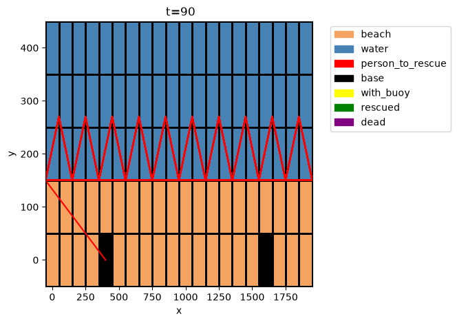

# Water Rescue fmdtools Simulation

This is a simulation of a beach water-rescue operation, built on the fmdtools resilience-modeling framework. It models a patrolling drone and a ground responder working together to detect and reach a distressed swimmer before their survival timer runs out. The drone flies a patrol path and drops a rescue buoy when reaching a distressed swimmer, while the responder sweeps a scan cone from its base and moves out to perform the rescue when either detecting a distresed swimmer itself or recieving an alert from the drone on patrol.

This is used to see how things will behave when something goes wrong, especially in scenarios that have never actually happened before. We referenced SysML models which were created from public data provided by news reports and the FDNY to model the behavior of the different actors in a scenario: the drone, the environment, and everything else involved in the scenario.



## Project structure

- demo.ipynb is an interactive walkthrough demonstrating the model, simulations, and visualizations.
- drone.py defines `BeachAircraft`, which patrols a zigzag flight path, detects swimmers in range, and switches to rescue mode.
- model_responder.py defines the ground `Responder`, including its peripheral/paracentral vision-zone geometry (via `shapely`) and rescue behavior.
- model_environment.py defines the `BeachMap` coordinate grid (beach/water/base/rescue zones) and swimmer distress/survival logic.
- model_main assembles the top-level `Beach` function architecture (environment, responder, swimmers, aircraft).

## Requirements
- Python 3.10+
- fmdtools (refer to [fmdtools Docs](https://nasa.github.io/fmdtools/docs-source/Development%20Guide.html#introductory-tutorial) to install dependencies for fmdtools)
- numpy
- shapely
- matplotlib

## Getting started

1. Clone the repository
    ```bash
    git clone https://github.com/kotharidhruv/Water-Rescue-fmdtools.git
    cd Water-Rescue-fmdtools
    ```
2. Create and activate a virtual environment
    ```bash
    python3 -m venv venv
    source venv/bin/activate # on Windows: venv\Scripts\activate
    ```
3. Install dependencies
    ```bash
    pip install fmdtools numpy shapely matplotlib jupyter
    ```
    Make sure to clone the fmdtools repo alongside this project for `fmdtools_examples` to be importable.
4. Run the demo notebook
    ```jupyter notebook demo.ipynb```

Contributors
------------------

* [Daniel Hulse](https://github.com/hulsed), team mentor
* [Dhruv Kothari](https://github.com/kotharidhruv), contributor 
* [Iris Chen](https://github.com/ir-s8), contributor 