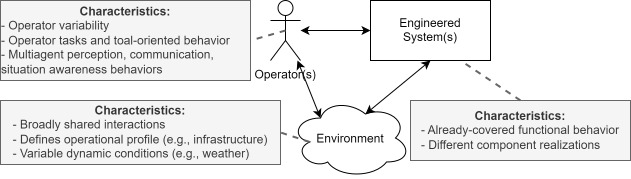
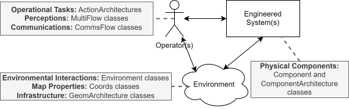
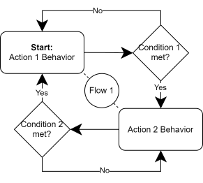
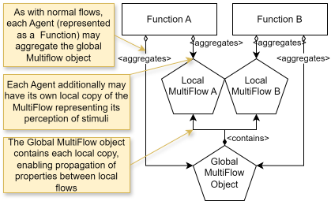
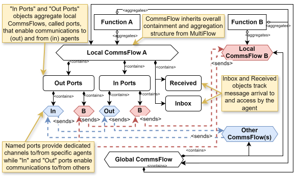

# Complex Systems Modeling in fmdtools
## Agenda and Format

- Introduce characteristics of more complex models 

- Overview of how fmdtools modeling classes let us represent these characteristics

    - Classes that represent this complexity
    - Example usages

## What makes a system complex? {.smaller}

The broader socio-technical system:

- Interactions between Operators, the physical system, and the Environment
- Example: Pilot (operator) controls the aircraft (physical system) through the airspace (environment)
- Safety is a result of safe interactions!

## How fmdtools can represent complexity

## Some Notes on Architectures {.smaller}

- Architectures are an extension of the `FunctionArchitecture` idea covered in [Intro_to_fmdtools.md](Intro_to_fmdtools.md)

- Architectures are just agglomerations of Blocks (Functions, Flows, or Components) and can include:
    - `FunctionArchitecture`: Functional behaviors and their interactions 
    - `ComponentArchitecture`: Physical Components fulfilling function(s)
    - `ActionArchitecture`: Logical sequence of operational tasks
    - `GeomArchitecture`: Physical geometries in a shared space

These all have different use-cases--not all work as top-level models.

## Example: ComponentArchitecture

Can be used to represent different sets of components fulfilling a given function.

**Code Templates**: See [`src/fmdtools/define/block/component.py`](../src/fmdtools/define/block/component.py) and [`src/fmdtools/define/architecture/component.py`](../src/fmdtools/define/architecture/component.py)

Example: Different Propulsion Architectures in a Drone, see: [`examples/human_hazard_mitigation.model_main.py`](../examples/human_hazard_mitigation.model_main.py)

## Human Actions, Perceptions, and Communications

- Important aspects of operator behavior

- Also relevant to Autonomous Systems

## Action Architectures {.smaller}

Can be used to represent different sets of actions performed in sequence or under different conditions, creating a structure like:

**Code Templates**: See [`src/fmdtools/define/block/action.py`](../src/fmdtools/define/block/action.py) and [`src/fmdtools/define/architecture/action.py`](../src/fmdtools/define/architecture/action.py)

Examples:
 - Human operator choosing to mitigate hazards: [`examples/human_hazard_mitigation/model_main.py`](../examples/human_hazard_mitigation/model_main.py)

 - Human-operated rover: [`examples/navigating_rover/model_human.py`](../examples/navigating_rover/model_human.py)

- Human-operated cooling tank: [`examples/cooling_tank/model_main.py`](../examples/cooling_tank/model_main.py)

## Perceptions - MultiFlow {.smaller}

- Extends concept of flow with *multiplicity* - meaning local copies of shared variables can be created to represent perceptions of these variables.

- See: [`src/fmdtools/define/flow/multiflow.py`](../src/fmdtools/define/flow/multiflow.py)

Example: State communication demo model: [`examples/state_communication.model_main.py`](../examples/state_communication.model_main.py)

## Communications - CommsFlow {.smaller}

- Provides communications "network" for passing information between agents

- See: [`src/fmdtools/define/flow/commsflow.py`](../src/fmdtools/define/flow/commsflow.py) 

Example: State communication demo model: [`examples/state_communication.model_main.py`](../examples/state_communication.model_main.py)

## Characteristics of Environments

- Needs to be broadly shared and perceived/communicated (note that `Environment` class is descendent of `CommsFlow`)

- External dynamic conditions (can be represented with a `Function`)

- Geospatial static and dynamic properties such as:

    - Terrain, temperature, pressure, etc. (See `Coords`). See code tempaltes at [src/fmdtools/define/object/coords.py](../src/fmdtools/define/object/coords.py)

    - Usable infrastructure like roads or runways and airports for airplanes (See `GeomArchitecture`). See code templates at [src/fmdtools.define/object/geom.py](src/fmdtools.define/object/geom.py) and [src/fmdtools/define/architecture/geom.py](src/fmdtools/define/architecture/geom.py)

Put together into a single `Environment` class, see [src/fmdtools/define/environment.py](src/fmdtools/define/environment.py)

## Integrated Architecture Examples

- airspacelib Contingency Management Model (Coords+GeomArchitecture): [examples/airspacelib/contingency_management/model_environment.py](../examples/airspacelib/contingency_management/model_environment.py)

- Line-following rover (GeomArchitecture): [examples/airspacelib/navigating_rover/model_main.py](../examples/airspacelib/navigating_rover/model_main.py)

- airspacelib Water Rescue Model (Coords): [examples/airspacelib/water_rescue/model_environment.py](../examples/airspacelib/water_rescue/model_environment.py)

- Multirotor Drone (Coords): [examples/multirotor_drone/model_urban.py](../examples/multirotor_drone/model_urban.py)

- Rover representing exploration (Coords): - Line-following rover (GeomArchitecture): [examples/airspacelib/navigating_rover/model_troupe.py](../examples/airspacelib/navigating_rover/model_troupe.py)

## Conclusions and Tips

- Not every "complex system" model needs every construct

- The goal of a simulation should always be representing what is needed for analysis, not every conceivable aspect

- The fmdtools library has many different modeling constructs for this! 

As models become more complex, it becomes more and more important to follow our [Best Practices](best-practices.md)