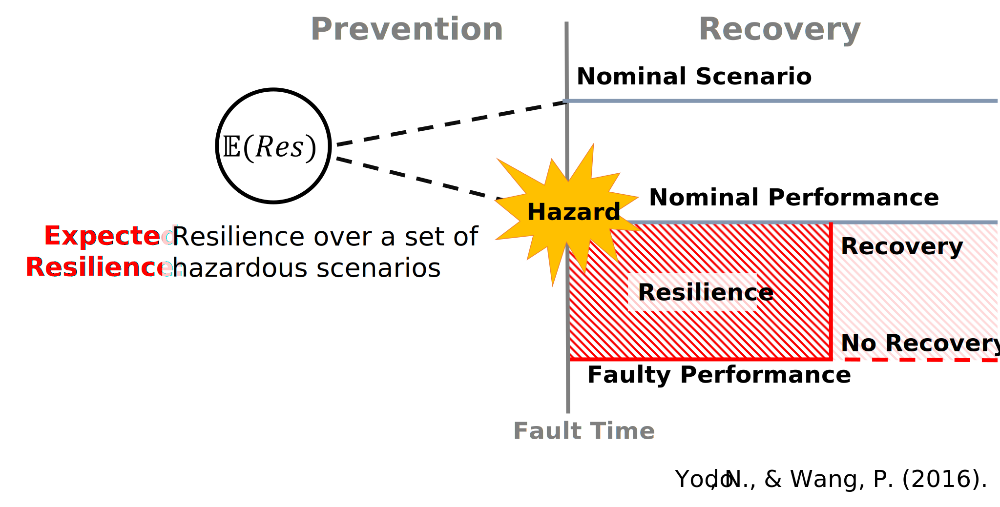
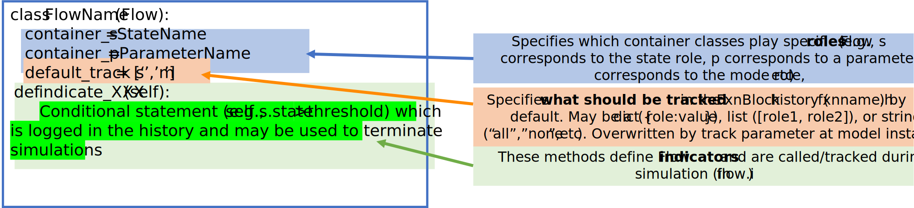
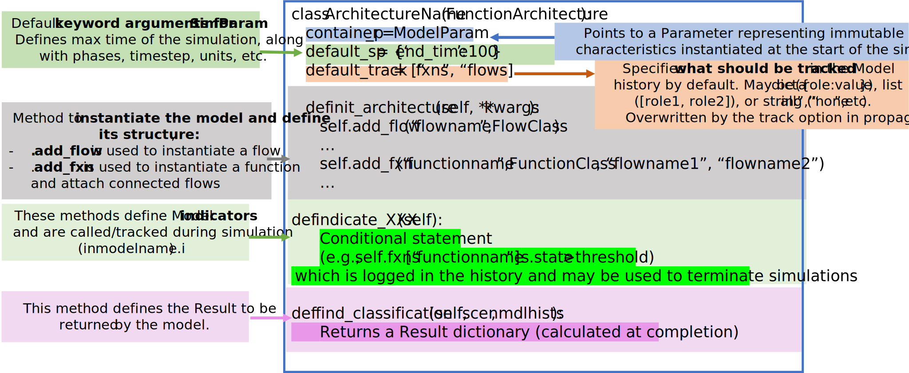
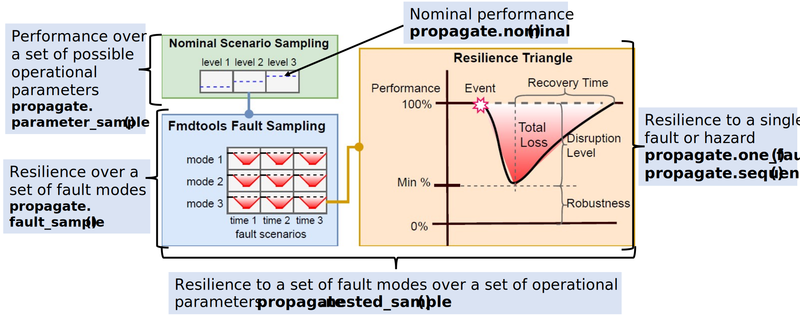

# Intro to resilience modeling, simulation, and visualization in Python with fmdtools.
### Author: Daniel Hulse 
### Version: 2.1.3

-----------------

# Overview

- **Overview of fmdtools**
    - Purpose
    - Project Structure
    - Common Classes/Functions
    - Basic Syntax
- **Coding Activity**
    - Example model: [`examples/pump/ex_pump.py`](../examples/pump/ex_pump.py)
    - Workbook: [`examples/pump/Tutorial_unfilled.ipynb`](../examples/pump/Tutorial_unfilled.ipynb)
        - Model Instantiation
        - Simulation
        - Visualization/Analysis

-----------------
# Prerequisites

- Ideally, some pre-existing Python and Git knowledge
- Python distribution (anaconda or uv)
    - Ideally this is already set up!
    - Download/install from:
        - https://www.anaconda.com/products/individual
        - https://github.com/astral-sh/uv
- A git interface
    - [Github Desktop](https://desktop.github.com/) (graphical git environment)
    - [git-scm](https://git-scm.com/) (stand-alone CLI)

-----------------
# Motivation: Modeling System Resilience

Resilience means taking a **dynamic understanding of risk and safety**

-----------------
# Why is Resilience Important?

-----------------

#  <!-- fit --> Enabling a proactive design process - especially when we don't have data

-----------------

# Why fmdtools? Possible Competitors:

- Uncertainty Quantification tools:  (e.g. OpenCossan)
    - Does not incorporate fault modeling/propagation/visualization aspects
- MATLAB/modelica/etc. Fault Simulation tools
    - Rely on pre-existing model/software stack--Useful, but often difficult to hack/extend (**not open-source**)
- Safety Assessment tools: (e.g. Alyrica, Hip-Hops)
    - Focused on quantifying safety, not necessarily resilience 
    - As a result, use **different model formalisms**!

-----------------

# Why fmdtools? Pros:

- Highly Expressive, modular model representation.
    - faults from any component can propagate to any other connected component 
    - highly-extensible code-based behavior representation
    - modularity enables **complex models** and modelling use-cases
- Research-oriented:
    - Written in/relies on the Python stack
    - Open source/free software
- Enables design:
    - Models can be parameterized and optimized!
    - Plug-and-play analyses and visualizations

-----------------

# Why **not** fmdtools? Cons:

- You already have a pre-existing system model
    - fmdtools models are built in fmdtools
    - if you have a simulink/modelica model, you may just want to use built-in tools

- You want to use this in production 
    - fmdtools is Class E Software and thus mainly suitable for research (or, at least, we don't guarantee it)
    - Somewhat dynamic development history

-----------------

# What is fmdtools? A Python package for **design**, **simulation**, and **analysis** of resilience.

-----------------

# What is fmdtools? Repo Structure

[Repository] (https://github.com/nasa/fmdtools/)
- `/fmdtools`: installable package directory
- `/examples`: example models with demonstrative notebooks and tests
- `/docs`: [HTML Documentation](https://nasa.github.io/fmdtools/) (source files at `/docs-source`)
- `/tests`: stand-alone tests (and testing rigs)
- Basic information: `README.md`, `CONTRIBUTORS.md`, `PUBLICATIONS.md`, `LICENSE`, `fmdtools_Individual_CLA.pdf`, etc.
- Config/test files: `requirements.txt`, `pyproject.toml`, `conf.py`, `index.rst`, etc.

-----------------

# Activity: Download and Install fmdtools

- repo link: https://github.com/nasa/fmdtools/
- set up repo:
    - create `path/to/fmdtools` folder for repo 
        - (usually in `/documents/GitHub`)
    - clone git into folder: 
        - `git clone https://github.com/nasa/fmdtools.git`
        - can also use webpage
- package installation: 
    - anaconda: Open Python from anaconda (e.g., open Spyder) and install with `pip install -e /path/to/fmdtools`
    - uv: run `uv pip install .` from fmdtools repository

-----------------

# Analysis Workflow/Structure

-----------------

# Defining a Model

- What do we want out of a model?
    - What behaviors and how much fidelity do we need?
    - What **functions/components** and interactions make up the system?
        - One function or multiple functions?
        - Is it a **controlled system**? Are there multiple **agents**?
- What type of simulation do we want to run?
    - Single-timestep vs multi-timestep vs network 
- What scenarios do we want to study and how?
    - **Failure modes** and faulty behaviors
    - **Disturbances** and changes in parameters
    - What are the possible effects of hazards and how bad are they? 
        - By what **metrics**?

-----------------

# Defining a Model

-----------------

# Concept: Static Propagation

In a single timestep, functions with `static_behavior()` methods simulate until behaviors converge (i.e., no new state values)

-----------------

# Concept: Propagation over Time

- Model increments (simulated + history updated) over each time-step until a **defined final time-step** or **specified indicator returns true**. 

- Functions with `dynamic_behavior()` run once in defined order

-----------------
# Containers - The building blocks of simulations

- Containers are used to define various attributes of Functions and Flows

-----------------
# Flow Code Template

- Flows represent connections or shared variables between different functions. Think of them as Function inputs/outputs.
- Flows are build from container classes like states, along with their own methods/variables.

-----------------
# Function Code Template

-----------------
# Function Architecture Code Template

-----------------
# Demo Model Activity: examples/pump/ex_pump.py

Notice the definitions and structure:
- **States**: `WaterStates`, `EEStates`, `SignalStates`
- **Flows**: `Water`, `EE`, `Signal`
- **Functions**: `ImportEE`, `ImportWater`, `ExportWater`, `MoveWater`, `ImportSignal`
    - **Modes** (e.g., `ImportEEMode`, `ImportSigMode`)
        - Mode probability model
        - Actual modes in `fm_args` entry
    - others attributes, e.g., `Timer`
- **Model**: `Pump` connects functions, flows, and defines `end_classification`
- **Parameter**: `PumpParam` defines values we can change in the simulation

-----------------

# More Resources for Model Definition

- Note the docs for model definition are in [https://nasa.github.io/fmdtools/docs-source/fmdtools.define.html](https://nasa.github.io/fmdtools/docs-source/fmdtools.define.html)

- Other examples also can be helpful: [https://nasa.github.io/fmdtools/examples/Examples.html](https://nasa.github.io/fmdtools/examples/Examples.html)

-----------------

# Notebook Activity:

Open `/examples/pump/Tutorial_unfilled.ipynb`:
- Instantiate the model
    - `mdl = Pump()`
- Explore structure
    - Try different parameters! 
    - Change things!
    What does the model directory look like? 
    - `dir(mdl)`

-----------------

# Simulation Concepts: Types of Simulations

For more info on syntax/arguments, see documentation for [`fmdtools.sim.propagate`](https://nasa.github.io/fmdtools/docs-source/fmdtools.sim.html#fmdtools-sim-propagate).

-----------------

# Simulation Concepts: Sampling Approaches

These classes define **multi-run simulations** which can be used to quantify uncertain performance/resiliences:

- **SampleApproach**/**FaultSample**: Which faults to sample and when
    - Relies on **mode** information encoded in the model
    - Simulated using `propagate.fault_sample()`

- **ParameterSample**: Nominal parameters or random seeds to sample
    - Can be simulated in `propagate.parameter_sample()`
    - Can be simulated in conjunction with faults using `propagate.nested_sample`

See docs for: [`fmdtools.sim.fault_sample`](https://nasa.github.io/fmdtools/docs-source/fmdtools.sim.html#module-fmdtools.sim.fault_sample)

-----------------

# Simulation Concepts: Things to Consider

**Static/Dynamic propagation:** How function states propagate to each other in a single time-step and multiple time-steps?

**Stochastic Propagation:** Whether and how stochastic states are instantiated over time
- e.g. do we run with the “default” values of parameters, or do we sample from a random number generator?

**Breadth of Scenarios:** How hazards are represented as discrete scenarios to simulate
- What set of joint faults do we use? How many times are sampled?
- Operational scenarios and joint operational/fault scenarios

-----------------

# Activity: Simulate the Model

Run fault propagation methods:
- `propagate.nominal()`,  `propagate.one_fault()`, `propagate.fault_sample()`

What do the results look like? Explore data structures:
- `analyze.result.Result`, `analyze.result.History`

Explore:
- What happens when you change `FaultSample` parameters?
- What happens when you change `Model` parameters?
- How do these methods compare in terms of computational time?

-----------------

# Analysis Modules - see docs for [`fmdtools.analyze`](https://nasa.github.io/fmdtools/docs-source/fmdtools.analyze.html)

-----------------

# Analysis Activity

**Visualize the results:**
- Show model graph
- Show nominal performances
- Show performances in a nominal scenario
- Make a scenario-based FMEA

**Explore:**
- How can you show only the parameters you want? Or change the formatting?
- What does the behavior under other faults look like?
- What other analyses can you perform with these results?

-----------------

# Conclusions/Summary

- **fmdtools** is an environment for designing resilient systems
    - `/define` enables model definition
    - `/sim` is used to define simulations
    - `/analyze` is used to analyze and visualize simulation results
- I hope you agree that it has some powerful features!
    - Modeling expressiveness and clarity
    - Types of simulations that can be run
    - Powerful but easy-to-leverage plug-and-play analyses

-----------------

# Further Reading/Links

- More advanced topics ([see examples](../examples/Examples.rst)), including Search and optimization, Human, Systems-of-Systems modeling, and Modeling Stochastic Behavior

- [Model Development Guide](https://nasa.github.io/fmdtools/docs-source/Development%20Guide.html#model-development-best-practices): Has best practices for developing models in a strategic way (especially helpful for complex models)
- Overview Paper: 
    - [Hulse, D., Walsh, H., Dong, A., Hoyle, C., Tumer, I., Kulkarni, C., & Goebel, K. (2021). fmdtools: A fault propagation toolkit for resilience assessment in early design. International Journal of Prognostics and Health Management, 12(3).](http://papers.phmsociety.org/index.php/ijphm/article/view/2954)
 
