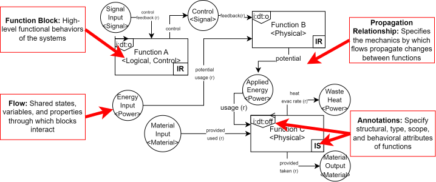
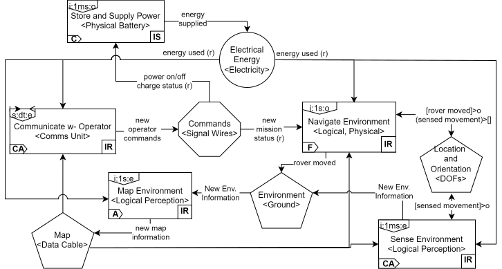
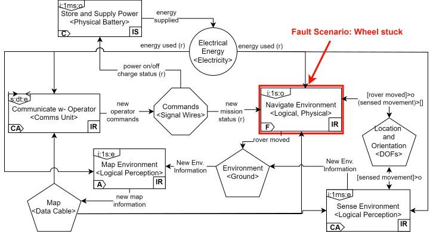
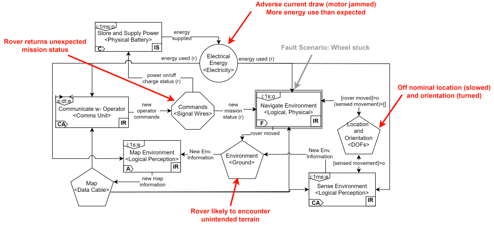
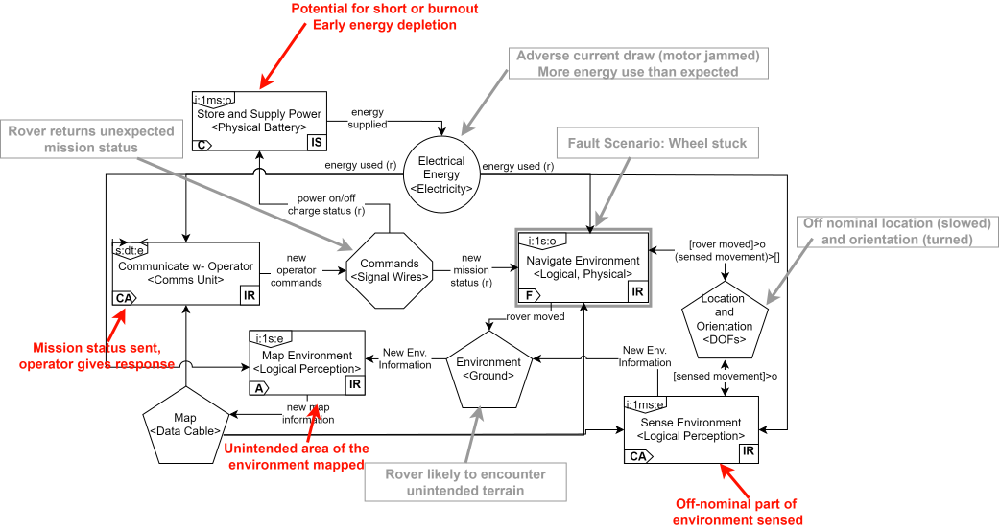
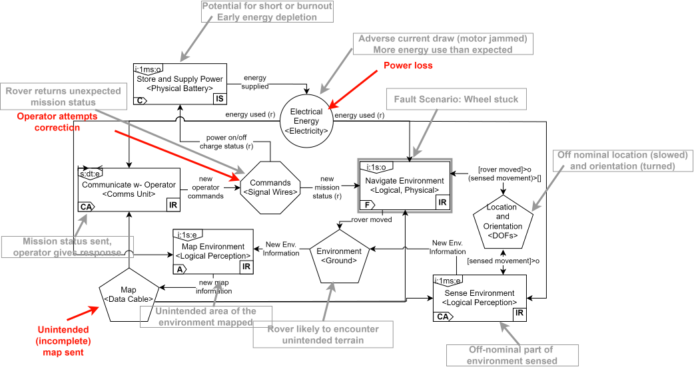
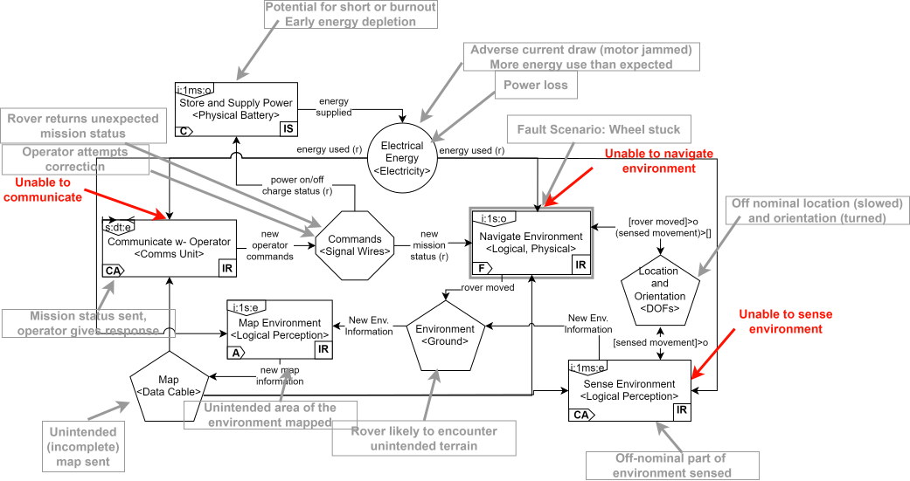
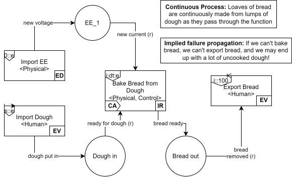
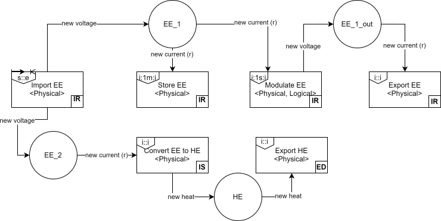

## Why Perform Hazard Analysis? {.smaller}

**The Need for Safety**

- Complex Safety-Critical Systems, like Aircraft, Nuclear Power Plants, and Human Spaceflight systems have a high expectations of safety and many potential points of failure

- To make the system safe, we first have to understand conditions (fault modes, disturbances, circumstances, scenarios, etc.) could make the system unsafe

- Hazard analysis helps us identify these conditions so we can mitigate them **in the design of the system**
  - When we can still add design mitigations (we aren't stuck operating an unsafe system)
  - Before the hazards are realized (we aren't surprised by hazardous events we could have mitigated)

## How do you perform hazard analysis? Depends on the process or standard! {.smaller}

- Examples of Processes:

    - Failure Modes and Effects Analysis (FMEA)
    - Functional Hazard Analysis (FHA)
    - Hazard and Risk Analysis (HARA)

- Examples of Standards:

    - **Generic:** ARP-926 "Fault/Failure Analysis Procedure"
    - **Automotive:** ISO-26262 "Road vehicles — Functional safety" 
    - **Aviation:** ARP-4761 "Guidelines And Methods For Conducting The Safety Assessment Process On Civil Airborne Systems And Equipment"

## What a generic hazard assessment process looks like: {.smaller}

1. **Define the system:** What is the name of the system (function, component, assembly, etc.) and what is its scope and environment (inputs, outputs, connections, operators, etc.)?
2. **Identify hazards:** What things could go wrong in the system (e.g., faults, environmental conditions, misuses) that could lead to harm (e.g., loss of function, damage to property, harm to people, operators or the environment)?
3. **Analyzing/assessing hazards:** What are the effects of these hazards in the relevant times when the system is operating (e.g., phases of operation, configurations)?

    - May come with an assessment of risk (e.g., severity/cost, probability/rate)

Based on this, one may prescribe **mitigations** to reduce hazard risks

## Constructing a hazard table (at its most basic) {.smaller}

| Function | Hazard | Causes  | Effects  |
| -------- | ------- | ------- |------- |
| Perform Job  | Incorrect Job Performed | Misunderstanding of work | Work incomplete |
|  | Poor Job Performance  | Stress, Distraction, etc. | Work late or incomplete
| Travel to Job site   | Late to job site | Traffic, oversleeping, poor planning | Unable to work full day

*Exercise:* Construct a hazard table for a system of your choice. It could be a physical product, a vehicle, software, a task/process, or anything else you can think of.

## What is FRDL (and why use it for hazard analysis)? {.smaller}

FRDL: Functional Reasoning Design Language

- Diagrams that you can use to represent the overall functions of a system and their *behavioral interactions* 

    - Functions: Functionality that the system provides
    - Behavioral interaction: Ways that the functions interact with each other

FRDL helps with hazard analysis by giving you a *model* of the system to base the assessment of causes and effects on

- Instead of just brain-storming possible causes/effects, you can use the model to see what parts of the system will be effected and how, giving you a more **complete** and **detailed** analysis
- Formal and rigorous way to represent behavioral interactions--instead of a flow chart, which misses multi-directional interactions, FRDL's bipartite graph representation explicitly enables the representation of all possible propagation paths.

## What does an FRDL diagram look like? 

An FRDL diagram is often called an [Architecture](https://nasa.github.io/fmdtools/docs-source/frdl.html#architectures) and is composed of:
 - [Blocks](https://nasa.github.io/fmdtools/docs-source/frdl.html#blocks) (Functions, Actions, or Components), which represent the behavioral elements of the system
 - [Flows](https://nasa.github.io/fmdtools/docs-source/frdl.html#flows) (including MultiFlow and CommsFlow sub-types), which represent the shared variables (e.g., energy, material, and/or signal) that cause the behavioral elements to interact
 - [Relationships](https://nasa.github.io/fmdtools/docs-source/frdl.html#relationships) that connect the model elements. Propagation relatinoships are shown
 - [Annotations](https://nasa.github.io/fmdtools/docs-source/frdl.html#annotations) are the symbols and text that appears on blocks. These annotations are optionally used to clarify dynamic behavior (Dynamics tag in upper left corner), point to other potential potential diagrams (architecture tag in lower left corner) and define the scope and role of the object (ontology in the lower right corner).

The figure above is a [Functional Architecture](https://nasa.github.io/fmdtools/docs-source/frdl.html#functional-architectures) because it represents Functions interacting via flows.

## What does an FRDL diagram look like? - Rover Example {.smaller}

This is a model of an autonomous rover that autonomously navigates and maps its environment based on its own senses, which it then communicates with an operator. 

Note the use of CommsFlow for "Commands" (meaning the flow is to be communicated) and the use of MultiFlow for "Environment", "Map" and "Location and Orientation" (meaning there are multiple copies due to perception or data flow).

## How do you analyze hazards with an FRDL diagram? {.smaller}

0.) Imagine how the system is supposed to work nominally

1.) Inject the hazardous condition(s) into the relevant function(s) and evaluate the effects on those functions

2.) Determine the impacts to each flow connected to the affected function(s) per the propagation arrows

3.) Repeat Step 1-2 for each function affected by the altered flow states until you've exhaustively elicited effects

For causes, run through this process in reverse. See [FRDL/Specification/Usage/Analysis](https://nasa.github.io/fmdtools/docs-source/frdl.html#analysis) for more details.

## Example - Step 1

In this scenario we look at what could happen if one of the rover's electrically-powered wheels gets stuck. Note that this is just one way it could play out, the point of this process is to identify potential hazardous propagations so they can be mitigated. 

## Example - Step 2

The wheel being stuck propagates to the connected flows: there is now adverse current draw from the electric motor (if it continues to provide power) and the rover now has a modified trajectory, yawing in the direction of the stuck wheel.

## Example - Step 1 (again)

These flow effects propagate to their connected functions: the rover identifies and communicates a faulty status. However, there is also a potential for short or early energy depletion from the battery.

## Example - Step 2 (again)

Given a short from the battery, there is now a power loss even though the operator attempts correction.

Given that these are all *potential effects*, this is where it can be helpful to branch the scenario into different possibilities:
- If the correction happens before power loss, the rover may be able to continue its mission in a corrected state
- If power loss happens before the correction, the rover will be unable to continue its mission

## Example - Finally

In the worst-case, the power loss happens before correction. As mentioned previously, this is just one way a scenario could play out, and there are several assumptions that result in this outcome which could be modified for a different analysis. For example, a wheel being stuck could trigger a disengagement of the motor to prevent jamming.

We expect hazard mitigating features like this in a real system, but getting there requires us to go through a systematic process to add those mitigations. That is what this analysis is for!

## Further Takeaways {.smaller}

- Analyzing behavior in FRDL means working **directly with the diagram** to determine hazard effects, as opposed to just coming up with the effects out of your head

- However, there is also an analytical component in terms of figuring out what would happen to each function/flow

- However, sometimes the diagram may not have the flows needed to propagate the behavior, in which case you would need to update the diagram

- One also has to make analysis decisions such as:
    - How to represent the system in FRDL
    - What assumptions to use when propagating behavior (and what scenarios to consider)
    - When to branch a scenario based on the potential ways individual interactions could play out
    - When to stop the analysis

## More Examples

| [Baking Bread](https://nasa.github.io/fmdtools/docs-source/frdl.html#bread-making) | [Circuit](https://nasa.github.io/fmdtools/docs-source/frdl.html#circuit) |
|:------------------:|:------------------:|
|  | |

- Some explanation of these examples is provided in [FRDL/Guide/Examples](https://nasa.github.io/fmdtools/docs-source/frdl.html#examples)

## More Helpful Information {.smaller}

- The [FRDL Specification and Guide](https://nasa.github.io/fmdtools/docs-source/frdl.html#) has a good overview of the details of developing FRDL models (as well as analyzing hazards)

- ["Defining A Modelling Language to Support Functional Hazard Assessment"](https://ntrs.nasa.gov/citations/20240006675) is the conference paper that initially defined the FRDL and describes some of the rationale for its development
    - Conference presentation [here](https://ntrs.nasa.gov/citations/20240010880)
    - A revised journal draft that is up-to-date with FRDL 0.7.1 (which is in review) may be provided upon request
