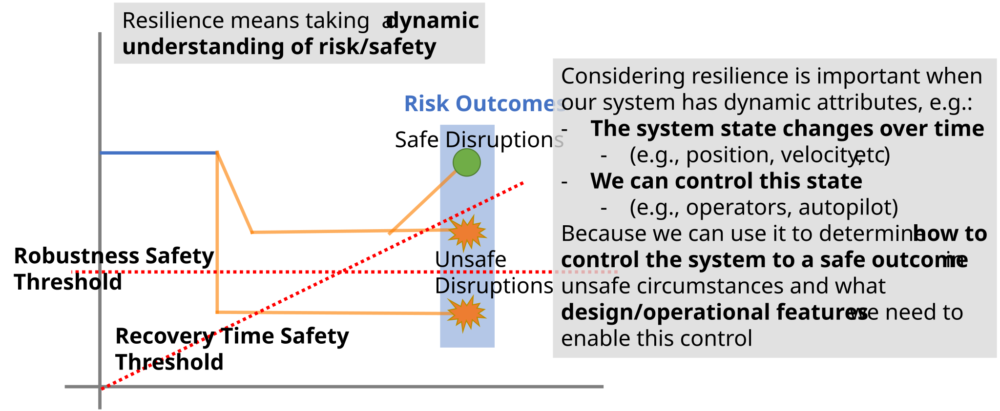

Development Guide
=================

Why fmdtools?
^^^^^^^^^^^^^

Use fmdtools to improve your understanding of the dynamics of hazardous behavior. The fmdtools library was developed to study resilience, which is an important consideration in designing safe, low-risk systems. Resilience is the ability of a system to mitigate hazardous scenarios as they arise. As shown below, the key defining aspect of resilience is the **dynamics of failure events**, which may lead to recovery (or, a safe outcome) or failure (or, an unsafe outcome).

   
   Resilience is important to consider when dynamics of system behavior can lead to hazardous or unsafe outcomes.

The impetus for developing fmdtools was a lack of existing open-source tools to model these dynamics at a high level (i.e., functions and flows) in the design process. Thus, researchers in this area had to re-implement modeling, simulation, and analysis approaches for each new case study or methodological improvement. The fmdtools package resolved this problem by separating resilience modeling, simulation, and analysis constructs from the model under study, enabling reuse of methodologies between case studies. The goals of the fmdtools project have since shifted to the more general goal of **improving the hazard assessment process** by better representing systems resilience. Towards this end, fmdtools provides the following capabilities:

- **Representing system dynamics** to enable the quantification of resilience properties. Typically, hazard assessment processes neglect the consideration of resilience because they focus on the immediate effects of faults on the function of the system, rather than an assessment of how these effects play out over time. The fmdtools library enables this consideration by providing a behavioral view of hazardous scenarios. This is important both for understanding hazardous behaviors, but also how they can be mitigated as they arise.

- **Representing operational behaviors and actions** to enable the assessment the contributions of human operators and autonomous/AI-enabled systems to overall risk and resilience. Traditional hazard assessment approaches do not consider the feedback between operators, the system, and the environment, instead leaving them as "accidents" or "mistakes" to be blamed on the operator. With fmdtools, these hazards can be considered directly by modelling potential operator behaviors and how they support or degrade overall systems resilience. These approaches can also be used to better understand the risks posed by AI/autonomous systems.

- **Enabling a Model/Simulation-based hazard analysis paradigm** by allowing the iterative, consistent analysis of resilience through the design, implementation, and V\&V processes. The traditional hazard assessment process is a manual, expert-driven approach that is inefficient to iterate on or change as a the design changes or assumptions are validated (or invalidated). In contrast, because all assumptions in fmdtools are represented as code, they can easily be modified as assumptions change while maintaining the overall integrity of the analysis. Furthermore, simulations in fmdtools can be efficiently and consistently be varied to analyze a system in more detail or in different configurations.

While this library primarily provides code structures, a major objective of this library is further to enable these techniques to be used in a graphical simulation tool for hazard assessment.

Introductory Tutorial
^^^^^^^^^^^^^^^^^^^^^

**The best place to start** to getting acquainted with basic syntax and functionality is the :doc:`Intro to fmdtools <Intro_to_fmdtools>` workshop (:download:`download slides as pdf <Intro_to_fmdtools.pdf>`), which uses the `Pump` example to introduce the overall structure and use of fmdtools. Other models are further helpful to demonstrate the full variety of methods/approaches supported in fmdtools and their application for more advanced use-cases.

.. toctree::
   :hidden:
   
   Intro_to_fmdtools.md

Glossary
^^^^^^^^

You can use the glossary as a reference to understand basic simulation and analysis concepts in fmdtools.

.. glossary::
	:sorted:

	Function
		A piece of functionality in a system which has its own defined behavior, modes, and flow connections, and may be further instantiated by a :term:`component architecture` or :term:`action sequence graph`. In general, functions are the main building block of a model defining how the different pieces of the system behave. Functions in fmdtools are specified by extending the :class:`~fmdtools.define.block.function.Function` class.
		
	Flow
		A data structure which connects functions--traditionally energy, material, or signal. Defined using the :class:`~fmdtools.define.flow.base.Flow` class.
	
	Role
		A defined attribute of an fmdtools class which refers to a user-defined (or default) subclass of a corresponding fmdtools data structure. For example, Blocks have the container `Block.s` (for state) which may be filled by a subclass of :class:`~fmdtools.define.container.state.State`.

	Internal Flow
		A flow object that is internal to a :class:`~fmdtools.define.block.function.Function` which is not present in the overall model definition.
	
	Model
		A simulation that defines system behavior. Models contain functions and flows, their graph connections, parameters related to the simulation configuration, as well as methods for classifying simulations. 
	
	Behavior
		How the states of a system unfold over time, including in the various :term:`mode` s it may encounter. Defined in :term:`Function` s, :term:`Component` s, and :term:`Action` s using :meth:`fmdtools.define.Block.behavior`, :meth:`fmdtools.define.Block.static_behavior`, and :meth:`fmdtools.define.Block.dynamic_behavior`.
	
	Graph
		A view of simulation construct connections and/or relationships embodied by the :class:`~fmdtools.analyze.graph.Graph` class and sub-classes (which uses networkx to represent the structure itself).
	
	Component
		A physical component that embodies specific behavior for a :term:`function`. May have :term:`mode` s and :term:`behavior` s of its own. Specified by extending the :class:`~fmdtools.define.block.component.Component` class.
		
	Component Architecture
		The physical embodiment of a :term:`function` that encompasses multiple :term:`Component` s. Represented via the :class:`~fmdtools.define.architecture.component.ComponentArchitecture` class. 
	
	Mode
		Discrete modifications of a :term:`behavior` specified as entries in the :meth:`~fmdtools.define.container.mode.Mode` class. Often used to control if/else statements in a :term:`behavior` method within a :term:`function`.
	
	Fault Mode
		Undesired :term:`mode`, which leads to hazardous behavior. For example, a lamp may have "burn-out" due to a "flicker" mode.
	
	Operational Mode
		Defined :term:`mode` that the system progresses through as a part of its desired functioning. For example, a light switch may be in "on" and "off" modes.

	Action Sequence Graph
		An instance of the :class:`~fmdtools.define.architecture.action.ActionArchitecture` which embodies a (human or autonomous) :term:`agent`'s sequence of tasks which it performs to accomplish a certain function. 
	
	Agent
		An actor which controls behaviors in a system. May be modeled as a :term:`function`.
		
	Environment
		The uncontrolled aspect of a system which may effect system inputs and behaviors. May be modeled as a :term:`function`.
	
	Action
		A specific task to be performed by an :term:`agent` used to represent human/autonomous operations. May be specified by extending the :class:`~fmdtools.define.block.action.Action` class and added to a :class:`~fmdtools.define.block.function.Function` as a part of an Action Sequence Graph :class:`~fmdtools.define.architecture.action.ActionArchitecture`.
	
	Rate
		The expected occurrence (frequency) of a given :term:`mode`, which may be specified in a number of ways in the :class:`fmdtools.define.container.mode.Mode` class.
		
	Cost
		A metric used to define severity of a scenario. While cost is defined in a monetary sense, it should often be defined holistically to account for indirect costs and externalities (e.g., safety, disruption, etc). One of the default outputs from :meth:`fmdtools.define.block.base.Simulable.classify()` for models or blocks.
		
	Expected Cost
		A metric used to define risk of a scenario, calculated my multiplying the :term:`rate` and :term:`cost`.
		
	Endclass
		The end-state classification given from :meth:`fmdtools.define.block.base.Simulable.classify()`.
	
	Scenario
		A specific set of inputs to a simulation, including :term:`parameters`, :term:`Fault Mode` s, and :term:`Disturbances`. Defined in :class:`~fmdtools.sim.scenario.Scenario`.
		
	Disturbances
		A specific sequence of variable values over time which may modify system behavior.

	Sample
		A set of :term:`scenario` s to simulate a model over to represent certain hazards or parameters of interest. May be generated using :class:`~fmdtools.sim.sample.FaultSample` for fault modes or :class:`~fmdtools.sim.sample.ParameterSample` for nominal parameters. 
	
	Nested Approach
		The result of simulating a fault sampling :term:`Approach` (:class:`~fmdtools.sim.sample.SampleApproach`) within a nominal :term:`Approach` (:class:`~fmdtools.sim.sample.ParameterSample`). Created in :func:`~fmdtools.sim.propagate.nested_sample()`.
	
	Static Propagation
		The undirected propagation of model behaviors within a timestep. Defined for each function using :meth:`fmdtools.define.block.Function.static_behavior`, which may run multiple times in a timestep until behavior has converged. The static :term:`behavior` s are propagated through the graph using the method :meth:`~fmdtools.define.architecture.function.FunctionArchitecture.prop_static()`.
	
	
	Dynamic Propagation
		The progression of model states over time. Defined for each function using :meth:`fmdtools.define.block.Function.dynamic_behavior`, which runs once per timestep. The dynamic :term:`behavior` s are propagated using the method :meth:`fmdtools.define.block.Function.static_behavior`, which may run multiple times in a timestep until behavior has converged. The static :term:`behavior` s are propagated through the graph using the method :meth:`~fmdtools.define.architecture.function.FunctionArchitecture.propagate()`.
	
	Propagation
		The simulation of :class:`~fmdtools.block.base.Simulable` :term:`behavior` s, including the passing of :term:`flow` s between :term:`function` s and the progression of model states over time.
	
	Resilience
		The expectation of defined performance metrics over time over a set of hazardous :term:`scenario` s, often defined in terms of the deviation from their nominal values.
	
	End-state
		The state of a :class:`~fmdtools.define.block.base.Simulable` at the final time-step of a simulation.
	
	FMEA
		A table outlining the risks of hazardous :term:`scenario` s in terms of their rate, severity, and expected risk. By default, the :mod:`~fmdtools.analyze.tabulate` module produces cost-based FMEAs, with the metrics of interest being :term:`rate`, :term:`cost`, and :term:`expected cost`, however these functions can be tailored to the metrics of interest.
	
	Behavior Over Time
		How a the states of a system unfold over time. Defined using :term:`behavior`.
	
	Model History
		A history of model states over a set of time steps defined in :class:`~fmdtools.analyze.history.History`. Returned in fmdtools as a nested dictionary from methods in :mod:`~fmdtools.sim.propagate`.

	FRDL
		See: :term:`Functional Reasoning Design Language`.

	Architecture
		Composition of blocks. Defined using :class:`~fmdtools.define.architecture.base.Architecture` and its sub-classes.

	Functional Reasoning Design Language
		Language used to define/represent the network structure and behavioral propagation of an :term:`Architecture`.

	Functional Architecture
		Composition of :term:`Function` and :term:`Flow` objects in an overall :term:`Architecture` that enables :term:`propagation` of behaviors between :term:`function` s.

Best Practices
^^^^^^^^^^^^^^

.. include:: ../PUBLICATIONS.md
   :parser: myst_parser.sphinx_