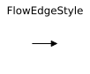
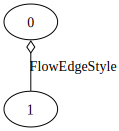
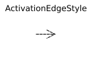
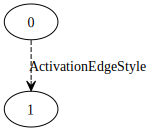
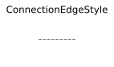

fmdtools.analyze.graph 
===========================
.. automodule:: fmdtools.analyze.graph

The graph sub-package is used to graphically represent models and has the following modules:

.. autosummary::

    fmdtools.analyze.graph.label
    fmdtools.analyze.graph.style
    fmdtools.analyze.graph.base
    fmdtools.analyze.graph.model

fmdtools.analyze.graph.label
--------------------------------

.. automodule:: fmdtools.analyze.graph.label
   :members:
   :undoc-members:
   :show-inheritance:

fmdtools.analyze.graph.style
--------------------------------

The style module defines graph attributes (nodes and edges) are visually represented as a part of an overall diagram.

Generally, it is the intent of fmdtools to comply with the :term:`FRDL` specification as much as possible, however, graphviz and networkx limit our ability to comply fully. Below we show how each :term:`FRDL` construct is visually represented in fmdtools:

.. |frdl_flowcon| image:: ../docs-source/figures/frdl/spec/flowconnection.svg

.. |frdl_activ| image:: ../docs-source/figures/frdl/spec/activation.svg

.. |frdl_prop| image:: ../docs-source/figures/frdl/spec/propagation.svg

.. |gv_conn| image:: ../docs-source/figures/frdl/gv/connection.svg

**Edges**

 +--------------------+----------------+-----------+-----------+
 | Construct          +  FRDL          + graphviz  + networkx  |
 +--------------------+----------------+-----------+-----------+
 | Flow Connection    + |frdl_flowcon| + |gv_flowc|+ |nx_flowc||
 +--------------------+----------------+-----------+-----------+ 
 | Activation         + |frdl_activ|   + |gv_activ|+|nx_activ| |
 +--------------------+----------------+-----------+-----------+ 
 | Flow Propagation   + |frdl_prop|    +    N/A    +  N/A      |
 +--------------------+----------------+-----------+-----------+ 
 | Weak Connection    + N/A            + |gv_conn| + |nx_conn| |
 +--------------------+----------------+-----------+-----------+ 
 
 .. |frdl_flow| image:: ../docs-source/figures/frdl/spec/flow.svg
 .. |nx_flow| image:: ../docs-source/figures/frdl/nx/flow.svg
 .. |gv_flow| image:: ../docs-source/figures/frdl/gv/flow.svg
 .. |frdl_mflow| image:: ../docs-source/figures/frdl/spec/multiflow.svg
 .. |nx_mflow| image:: ../docs-source/figures/frdl/nx/multiflow.svg
 .. |gv_mflow| image:: ../docs-source/figures/frdl/gv/multiflow.svg
 .. |frdl_cflow| image:: ../docs-source/figures/frdl/spec/commsflow.svg
 .. |nx_cflow| image:: ../docs-source/figures/frdl/nx/commsflow.svg
 .. |gv_cflow| image:: ../docs-source/figures/frdl/gv/commsflow.svg
 .. |frdl_fxn| image:: ../docs-source/figures/frdl/spec/function.svg
 .. |nx_fxn| image:: ../docs-source/figures/frdl/nx/function.svg
 .. |gv_fxn| image:: ../docs-source/figures/frdl/gv/function.svg
 .. |frdl_act| image:: ../docs-source/figures/frdl/spec/action.svg
 .. |nx_act| image:: ../docs-source/figures/frdl/nx/action.svg
 .. |gv_act| image:: ../docs-source/figures/frdl/gv/action.svg
 .. |frdl_com| image:: ../docs-source/figures/frdl/spec/component.svg
 .. |nx_com| image:: ../docs-source/figures/frdl/nx/component.svg
 .. |gv_com| image:: ../docs-source/figures/frdl/gv/component.svg
 .. |nx_con| image:: ../docs-source/figures/frdl/nx/container.svg
 .. |gv_con| image:: ../docs-source/figures/frdl/gv/container.svg
 .. |nx_arch| image:: ../docs-source/figures/frdl/nx/architecture.svg
 .. |gv_arch| image:: ../docs-source/figures/frdl/gv/architecture.svg
 
 **Nodes**
 
 +--------------------+----------------+-----------+-----------+
 | Construct          +  FRDL          + graphviz  + networkx  |
 +--------------------+----------------+-----------+-----------+
 | :term:`Flow`       + |frdl_flow|    + |gv_flow| + |nx_flow| |
 +--------------------+----------------+-----------+-----------+ 
 | :term:`MultiFlow`  + |frdl_mflow|   + |gv_mflow|+ |nx_mflow||
 +--------------------+----------------+-----------+-----------+  
 | :term:`CommsFlow`  + |frdl_cflow|   + |gv_cflow|+ |nx_cflow||
 +--------------------+----------------+-----------+-----------+ 
 | :term:`Function`   + |frdl_fxn|     + |gv_fxn|  + |nx_fxn|  |
 +--------------------+----------------+-----------+-----------+ 
 | :term:`Action`     + |frdl_act|     + |gv_act|  + |nx_act|  |
 +--------------------+----------------+-----------+-----------+
 | :term:`Component`  + |frdl_com|     + |gv_com|  + |nx_com|  |
 +--------------------+----------------+-----------+-----------+
 | Container          +  N/A           + |gv_con|  + |nx_con|  |
 +--------------------+----------------+-----------+-----------+  
 | Architecture       + N/A 	       + |gv_arch| + |nx_arch| |
 +--------------------+----------------+-----------+-----------+  

.. automodule:: fmdtools.analyze.graph.style
   :members:
   :undoc-members:
   :show-inheritance:

fmdtools.analyze.graph.base
--------------------------------

Graphing in fmdtools relies on the Graph class, which can be used to plot different characteristics of graphs using :term:`FRDL`.

While this is the intent of the graph package, there are some inherent limitations with working with networkx/graphviz, and not all :term:`FRDL` constructs are representable in fmdtools at present.

See the following examples for "typical" representation of an architecture. In this example, activation arrows were added to the Graph structure, which is possible when working with the base :class:`Graph` class, but often is not added in :Class:`ModelGraphs` because the information has not been defined in underlying model constructs.

 .. |frdl_dec| image:: ../docs-source/figures/frdl/spec/funcdecomp.svg
 .. |nx_dec| image:: ../docs-source/figures/frdl/nx/funcdecomp.svg
 .. |gv_dec| image:: ../docs-source/figures/frdl/gv/funcdecomp.svg

 +--------------------+----------------+-----------+-----------+
 | Use-case           +  FRDL          + graphviz  + networkx  |
 +--------------------+----------------+-----------+-----------+
 | Decomposition      + |frdl_dec|     + |gv_dec|  + |nx_dec|  |
 +--------------------+----------------+-----------+-----------+ 

.. automodule:: fmdtools.analyze.graph.base
   :members:
   :undoc-members:
   :show-inheritance:

fmdtools.analyze.graph.model
--------------------------------

.. automodule:: fmdtools.analyze.graph.model
   :members:
   :undoc-members:
   :show-inheritance:

