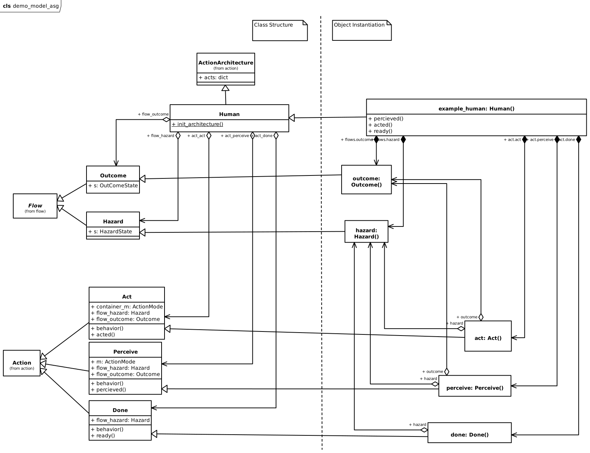
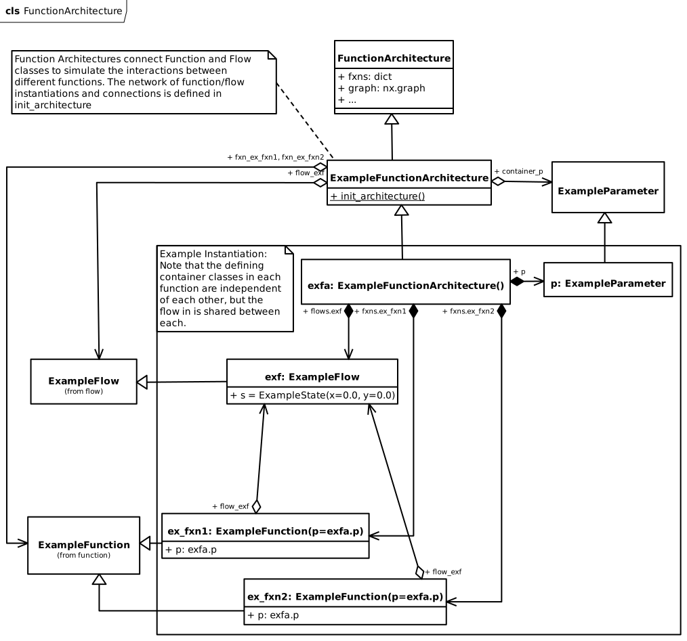
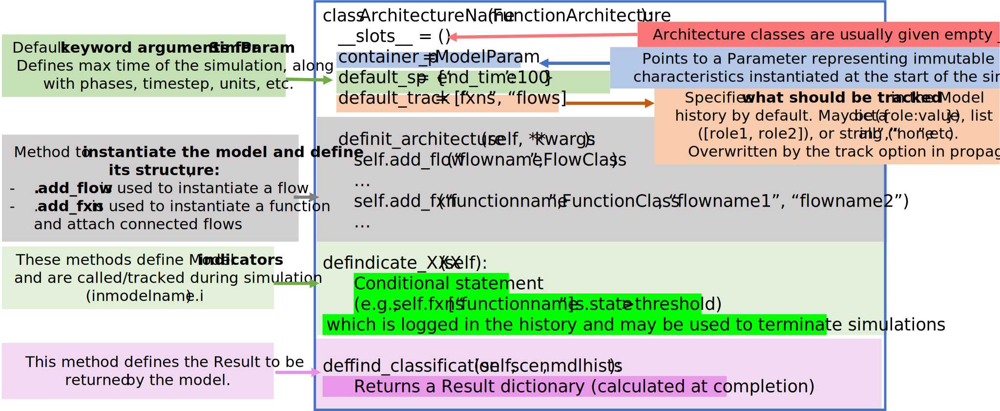

fmdtools.define.architecture
===========================
.. automodule:: fmdtools.define.architecture

The architecture subpackage provides a representation of :term:`Architecture` which may be used to represent aggregations/interactions of blocks in an overall combined simulation.

Different types of architectures are provided in the following modules:

.. autosummary::

	fmdtools.define.architecture.base
	fmdtools.define.architecture.action
	fmdtools.define.architecture.component
	fmdtools.define.architecture.function
	fmdtools.define.architecture.geom

fmdtools.define.architecture.base
--------------------------------

.. automodule:: fmdtools.define.architecture.base
   :members:
   :undoc-members:
   :show-inheritance:

fmdtools.define.architecture.action
--------------------------------
.. automodule:: fmdtools.define.architecture.action

The ActionArchitecture class is used to represent a sequenced of action taken by an agent. It is a composition of instantiated Action objects, Flow objects, and conditions as shown below:

   
   Example Action Architecture connecting action objects with flow objects and conditions.

In the Human action architecture, a human operator percieves and acts on a hazard and the total number of hazards acted on is recorded in the outcome flow. This can also be represented in :term:`FRDL` using:

.. figure:: ../examples/asg_demo/demo_model_asg_FRDL.svg
   :width: 600
   :alt: Structure of an ActionArchitecture in FRDL
   
   Propagation network of example Action Architecture.

For more info on this example, see: `The Action Sequence Graph Demo Model <../examples/asg_demo/readme.rst>`_.

.. autoclass:: fmdtools.define.architecture.action.ActionArchitecture
   :members:
   :undoc-members:
   :show-inheritance:

The ActionArchitecture class can further be represented graphically using the ActionArchitectureGraph class:

.. autoclass:: fmdtools.define.architecture.action.ActionArchitectureGraph
   :members:
   :undoc-members:
   :show-inheritance:

fmdtools.define.architecture.component
--------------------------------

.. automodule:: fmdtools.define.architecture.component
   :members:
   :undoc-members:
   :show-inheritance:

fmdtools.define.architecture.function
--------------------------------
.. automodule:: fmdtools.define.architecture.function

The FunctionArchitecture class is used to define the high-level function-flow structure of a system model. It is a composition of instantiated Function and Flow objects, as shown below:

   
   Example Function Architecture connecting function objects with flow objects.

In :term:`FRDL`, this object may be represented as:

.. figure:: figures/uml/FRDL_Function_Example.svg
   :width: 800
   :alt: Example Function Represented in FRDL
   
   Example Function Architecture propagation structure represented in FRDL.

To define a FunctionArchitecture class, it can be helpful to use the following code template:

   
   Code template for FunctionArchitecture classes.

.. autoclass:: fmdtools.define.architecture.function.FunctionArchitecture
   :members:
   :undoc-members:
   :show-inheritance:

The FunctionArchitecture class can be represented with a number of dedicated graph classes, below:

.. autoclass:: fmdtools.define.architecture.function.FunctionArchitectureGraph
   :members:
   :undoc-members:
   :show-inheritance:

.. autoclass:: fmdtools.define.architecture.function.FunctionArchitectureFxnGraph
   :members:
   :undoc-members:
   :show-inheritance:

.. autoclass:: fmdtools.define.architecture.function.FunctionArchitectureFlowGraph
   :members:
   :undoc-members:
   :show-inheritance:

.. autoclass:: fmdtools.define.architecture.function.FunctionArchitectureTypeGraph
   :members:
   :undoc-members:
   :show-inheritance:

fmdtools.define.architecture.geom
--------------------------------

.. automodule:: fmdtools.define.architecture.geom
   :members:
   :undoc-members:
   :show-inheritance: