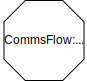

fmdtools.define.flow
===========================
.. automodule:: fmdtools.define.flow

The flow subpackage provides a representation of flows, which are used to connect Blocks in an Architecture. Different types of flows are provided in the following modules, as shown below/

   
   Different types of flows defined in fmdtools.

These are provided in the modules:

.. autosummary::

	fmdtools.define.flow.base
	fmdtools.define.flow.multiflow
	fmdtools.define.flow.commsflow

fmdtools.define.flow.base
-------------------------

.. automodule:: fmdtools.define.flow.base

Flow classes are used to represent variables that are shared between blocks, such as connections or a shared environment.
 
Flows are represented symbolically as circles in fmdtools visualizations, as shown below: 
.. figure:: figures/frdl/primitives/flow.svg
   :width: 50
   :alt: Example flow class symbol

 Like blocks, flows (see example below) can hold containers (e.g., States, Parameters, etc.) in order to represent different properties:

.. figure:: figures/uml/Flow.svg
   :width: 800
   :alt: flow class structure

   Example flow class structure.

The following template shows the basic syntax used to define simple flows in a system:

.. figure:: figures/powerpoint/flow_structure.svg
   :width: 600
   :alt: Flow class template/example.
   
   Flow class template/example.

.. autoclass:: fmdtools.define.flow.base.Flow
   :members:
   :show-inheritance:

fmdtools.define.flow.multiflow
------------------------------

MultiFlow can be used to represent signals and perceptions in which a flow may have independent copies on the side of the source and perceiver.

Flows are represented symbolically as pentagons in fmdtools visualizations, as shown below: 

 MultiFlow enables the representation of independent flow copies in a single class using the structure shown below:

.. figure:: figures/drawio/MultiFlow.svg
   :width: 800
   :alt: MultiFlow class structure.
   
   Illustration of the class structure for MultiFlows.

.. automodule:: fmdtools.define.flow.multiflow
   :members:
   :undoc-members:
   :show-inheritance:

fmdtools.define.flow.commsflow
------------------------------

CommsFlow can be used to represent communication exchanges between agents. CommsFlows are represented as octagons in fmdtools model visualizations:

CommsFlow enables this passing of exchanges using the structure shown below:

.. figure:: figures/drawio/CommsFlow.svg
   :width: 800
   :alt: Example multiflow class
   
   Illustration of CommsFlow class structure.

.. automodule:: fmdtools.define.flow.commsflow
   :members:
   :undoc-members:
   :show-inheritance:
