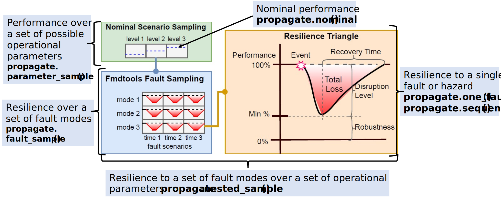

fmdtools.sim 
=========================
.. automodule:: fmdtools.sim

The :mod:`fmdtools.sim` package is used to simulate models. It consists of four modules:

.. autosummary::

	fmdtools.sim.propagate
	fmdtools.sim.scenario
	fmdtools.sim.sample
	fmdtools.sim.search

fmdtools.sim.propagate 
----------------------------------

The :mod:`~fmdtools.sim.propagate` module is used to simulate the behaviors of a :class:`~fmdtools.define.block.base.Simulable` (`Model` or `Block`) with and without faults. As shown above, each of the methods (described below) fit a given simulation use-case for resilience assessment--single/multiple scenarios, in nominal/faulty scenarios, and at a single set or multiple sets of parameters.

.. automodule:: fmdtools.sim.propagate
   :members:
   :undoc-members:
   :show-inheritance:
   
fmdtools.sim.scenario
----------------------------------

.. automodule:: fmdtools.sim.scenario
   :members:
   :undoc-members:
   :show-inheritance:
   
fmdtools.sim.sample
----------------------------------

.. automodule:: fmdtools.sim.sample
   :members:
   :undoc-members:
   :show-inheritance:

fmdtools.sim.search
----------------------------------

.. automodule:: fmdtools.sim.search
   :members:
   :undoc-members:
   :show-inheritance:
