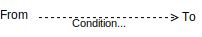
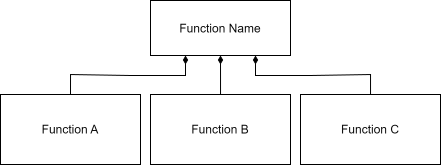

.. _frdl:

FRDL 
====

Functional Reasoning Design Language, Version 0.7

Overview
^^^^^^^^

FRDL stands for the Functional Reasoning Design Language, which is a graphical language for describing the functional architecture of a system. A functional architecture (often known as a `functional model <https://en.wikipedia.org/wiki/Function_model>`_, `functional decomposition <https://en.wikipedia.org/wiki/Functional_decomposition>`_, `function-flow block diagram <https://en.wikipedia.org/wiki/Functional_flow_block_diagram>`_)  describes the high-level functionalities (or, functions) that are to be embodied by a system, along with the interactions between these functionalities. Diagrams of functional architectures (like those enabled by FRDL) enable *functional reasoning* by providing a means to abstract away irrelevent aspects of system structure and behavior while focusing on the key (that is, functional) elements. Functional reasoning can support a range of design and analysis activities by encouraging clear reasoning about how a system operates and what it is supposed to do at a high level. This can facilitate many important design and analysis activities, including `product design (and especially redesign) <https://link.springer.com/book/10.1007/978-1-84628-319-2>`_, behavioral simulation, and `hazard analysis <https://en.wikipedia.org/wiki/Failure_mode,_effects,_and_criticality_analysis>`_.

What can you use FRDL for?
--------------------------

As a language, FRDL can be used to support a range of activities where functional reasoning can be helpful, and is thus meant as a drop-in replacement to many existing functional modelling languages (such as block diagrams, energy-materials-signals models, etc.). However, the main focus of FRDL has been improving hazard analysis through its explicit representation of behavioral interactions. In the context of hazard analysis, FRDL models can be used to identify potential causes and effects of hazardous conditions, by tracing the interactions between functions that could induce or be affected by these conditions.

Why FRDL?
---------

FRDL was developed to improve the analytical rigor of the diagrams that analysts typically use to perform hazard analysis to better support causal reasoning. Compared to other languages, it has a few key features and advantages:

- FRDL encourages functional reasoning, which is a key and long-appreciated part of hazard analysis. While existing hazard analysis approaches reccomend using a ``functional'' approache early in design, they often do not provide well-defined idea of what a "function" is, which can lead to confusion and ultimately poor reasoning. FRDL resolves this issue by providing a *way of thinking* about function which comports both to 

- FRDL encourages (or rather, requires) the consideration of behavioral interactions. These behavioral interactions are key for understanding both (1) how hazardous conditions can lead to downsteam hazards and (2) how hazarous conditions can arise in a system. Without this explicit representation of behavioral interactions, analysts are left to either (1) use very simplistic reasoning based on what models do represent (e.g., if a function within another function fails, the containing function must also fail) or (2) rely on their own mental models of system behavior (which at the very least lack traceability and justification, and at the very most could be undetectably flawed).

- FRDL offers a scalable representation of system complexity that enables the representation of diverse interactions in highly complex systems. Unlike other methods--such as STAMP and block diagrams, which encode interactions as arrows, these interactions are represented in FRDL as nodes, making it possible to more scalably represent diverse interactions in a system that affect more than one function. This approach also encourages the grouping of like interactions, as well as the representation of wide-reaching interactions such as communications in a system-of-systems.

- FRDL explicitly supports annotations to support more detailed information to be used in analysis when it is available. Specifically, FRDL annotations can be used to better represent the dynamics of behavior (e.g., when functionality is active versus inactive) to inform the analysis of system resilience to hazards.

- FRDL enables the direct integration with the fmdtools simulation library, meaning that hazard models in FRDL can be directly implemented in simulation (rather than what is typical--simulations of system behavior looking much different from the original functional model).

Relationship with fmdtools
--------------------------

FRDL has been developed as a specification for fmdtools models, such that a functional architecture developed in FRDL can be directly implemented as an fmdtools :class:`FunctionArchitecture`. While this correspondence is supported by the fmdtools data model, the display of these structures often veers from the FRDL specification (see :ref:`fmdtools_graph_style`) due to limitations in the graphical libraries fmdtools uses to display architectures. Additionally, fmdtools does not currently support defining/displaying the annotations in frdl, showing only the graph structures instead. One of the development goals for fmdtools is thus to bring these features of FRDL into the library, as well as provide an interface for translating externally-supplied FRDL models into fmdtools Architecture classes.

Specification
^^^^^^^^^^^^^

FRDL represents System `Architectures`_ by composing node and edge `Primitives`_ into an overall graph of system interactions with a defined `Interpretation`_.

Primitives
----------

Primitives are the nodes and edges used to create `Architectures`_, including:

Blocks
""""""

.. figure:: figures/frdl/primitives/blocks.svg
   :width: 800
   :alt: FRDL Block Classes

Blocks in FRDL are behavioral elements of the system, meaning they are expected to perform a given behavior. Behavior is any operation, such as an equation, modification, or constraint that the block imposes on the system. For example, ``flying,`` ``transfering heat,`` and ``set x to one`` may all be considered behaviors which blocks would embody. Blocks may further be annotated by `Block Annotations`_ to describe structural and behavioral properties of the block. FRDL supports three major block classes, shown above and described below.

Block draw.io shapes are defined :download:`here <../frdl/primitives/blocks.drawio>`.

Components
''''''''''

Components refer to concrete parts that physically make up a system. These components may have multiple behaviors that interact in different ways. For example, an engine, a wheel, and a brake would all be different components of a car. Components may be used in the context of `Component Architectures`_ to represent the embodyment of a function in real-world parts. Components correspond directly to the fmdtools :class:`~fmdtools.define.block.component.Component` class.

Actions
'''''''

Actions refer to discrete, logical steps preformed in controlling a system to accomplish an overall task. For example, "Turn On"/"Turn Off" and "Turn left"/"Turn right" are both actions that a user might perform on the system in order to use it. Actions are logical behaviors, and thus should be thought of as software (e.g., control logic) or human reasoning. Actions correspond directly to the fmdtools :class:`~fmdtools.define.block.action.Action` class.

Functions
'''''''''

Functions describe *generic abstract functionality* that the system is to be embody. As opposed to what a system ``is'' (e.g., a collection of parts), functions describe what a system ``does.'' Functions may be labeled as verbs acting on nouns (e.g., "process ore into iron"), verbs (e.g., "navigate"), or a set of tasks (e.g., "store and supply energy"). As primarily behavioral elements, functions can additionally be thought of as comprising one or multiple governing equations of the system.  Functions correspond directly to the fmdtools :class:`~fmdtools.define.block.function.Function` class.

Because functions are hybrid elements, they can be embodied by physical components (see: `Function/Action Relationship`_), logical actions (see: `Function/Component Relationship`_), more elemental functions, and architectures.

Block Annotations
"""""""""""""""""

.. figure:: figures/frdl/primitives/block_annotations
   :width: 800
   :alt: FRDL Block Annotations

Annotations may be used to clarify known properties of the block. An overview of these annotations (described next) is provided above. While it is not required to use any of these annotations, they are provided as a part of the language to better inform analyses with relevant information.

Block annotations draw.io templates are defined :download:`here <../frdl/primitives/block_annotations.draw.io>`.

Dynamics Tag
''''''''''''

From left to right, dynamics tags specify:

- the start time or condition, which may be "i" to specify that it starts when activated (if activations are numbered their ID may be provided here also), "s" to specify that it starts at scenario start, and a value (e.g., "10s") to specify a given time.
- the change interval, which may be "dt" if unspecified/continuous or a given value (e.g., "5s") if there is a given timestep for the behavior
- the end time or condition, which may be "o" to specify that it ends at a given activation propagating out (if activations are numbered an ID may be provided here), "e" to specify that it ends at the end of the scenario, and a number (e.g., "120s") to specify a given end time.

An additional arrow symbol a the upper left of the tag specifies that the block starts the scenario, while a fork symbol at the upper right of the tag specifies that the block ends the scenario.

Dynamics tags are placed in the upper left corner of the block. 

Behavior Type Annotation
''''''''''''''''''''''''

Behavior type annotations help provide more details at the block level which may help describe the block. Behavior type annotations are especially relevant to Functions, where they can help explain the expected embodiment of the function (e.g. "Battery" for a "Supply Power" function) and/or what is expected from the function. These annotations may be placed immediately below the name of the block.

Architecture Tag
''''''''''''''''

Architecture tags specify whether a block contains within itself a Component, Action, or Function architecture, or some combination, by listing each letter (C, A, and/or F) in the tag. These are primarily to be used when there are additional architecture diagrams which may be referenced to describe the block. The architectue tag is placed in the lower-left corner of the block.

Ontology Tag
''''''''''''

The ontology tag refers to the scope the block takes and its role within that scope. The scopes include:

- Internal, meaning that the block is a part of the designed/operated system. Within this scope, the "required" role specifies that the block is a user/operator requirement, the "supporting" role specifies that the block supports a required block, while the "constraining" role specifies that the block is a technical constraint placed on the system  (e.g., laws of physics that must be followed regardless of whether they are desired).
- External, meaning that the block is external to the system. Within this scope, the "defined" role specifies that the block is a well-defined interface and not likely to vary, the "variable" role specifies that the block may vary outside of the control of the user/operator, and the "adversarial" role specifies that the block is taking actions against the interest/functioning of the system.

The ontology tag is placed in the lower right of the block.

Flows
"""""

Flows represent the means by which blocks may interact, and may be thought of as shared variables, inputs/outputs, or a shared environment. For example, in a circuit, electricity represents the flow between elements of the circuit.

.. figure:: figures/frdl/primitives/types_of_flow.svg
   :width: 800
   :alt: FRDL Flow classes.

There are three main types of flow, shown above. Base flows represent directly coupled links between functions (i.e., an aggregation), meaning that properties of the flow in one block directly correspond to the properties of the flow in another. Flows correspond directly to the :class:`~fmdtools.define.flow.base.Flow` class in fmdtools.

Flows have additional variations, including `MultiFlow`_ and `CommsFlow`_s, described next.

Flow draw.io templates are defined :download:`here <../frdl/primitives/flows.draw.io>`.

MultiFlow
'''''''''

MultiFlows are flows with some level of multiplicity, which may be used when blocks *may* have their own individual "views" of the flow. One block's MultiFlow properties thus may not necessarily correspond to the properties of another block's MultiFlow. MultiFlows correspond directly to the :class:`~fmdtools.define.flow.multiflow.MultiFlow` class in fmdtools.

CommsFlow
'''''''''

CommsFlows are flows that make up a communications network (or mesh) between different blocks. CommsFlows thus specify a given structure for sending/recieving flow properties to any or all other connected blocks. CommsFlows correspond directly to the :class:`~fmdtools.define.flow.commsflow.CommsFlow` class in fmdtools.

Relationships
"""""""""""""

Relationships are edges connecting nodes in a model graph that specify how nodes (blocks and flows) relate to each other. When used in larger UML or SysML ecosystem, edges can specify a wide range of logical and behavioral concepts. For the purpose of architecture modelling, FRDL relies on connection, activation, and propagation edges (shown below) to specify behavioral interactions.

Draw.io templates for the relationship types are defined :download:`here <../frdl/primitives/relationships.draw.io>`.

Connection
''''''''''

.. figure:: figures/frdl/primitives/flowconnection.svg
   :alt: Connection

Connection arrows (shown above) specify that a flow is to be considered jointly a part of two or more blocks. In doing so, the flow ``connects'' the blocks. This connection is equivalent to a **shared association** in UML/SysML, meaning that the flow is considered a part of all blocks it is connected to, but is not owned by any of them.

While connection arrows specify this joint connection, they do not in and of themselves specify a behavioral interaction between connected blocks. Instead they specify that a given flow is a *means* by which the blocks could interact.

Activation
''''''''''

Activation arrows (shown above) specify that a condition in one block causes a condition in (or, ``activates'') another block. Activation arrows can be annotated with text specifying the condition that causes the activation. Activation arrows can be used in Action Architectures to specify sequences of tasks that complete one after the other (similar to a activity diagram or finite state machine).

Propagation
'''''''''''

.. figure:: figures/frdl/primitives/propagation.svg
   :alt: Propagation

Propagation arrows (shown above) represent the propagation of behavior between blocks via flows. In this way propagation arrows represent the composition of Connection and Activation relationships, specifying both (1) the means by which blocks interact and (2) the specific conditions that cause activation (new or modified behavior) in each block. Propagation arrows specify the directionality of propagation using two different conventions:

- Unidirectional Propagation, which provides a single arrow in the direction of propagation. Conditions causing changes in behavior in the direction of the arrow may be overlaid on top of the arrow, while conditions which cause changes in the reverse direction of the arrow may be specified with an (r) at the end of the test. This enables the tractable representation of coupled interactions where there is a defined sequence (e.g., energy flows in one direction from a battery to a light bulb) but interactions may flow in both directions (e.g., a bulb burning out cuts power use).
- N-Directional Propagation, which provides arrows in both directions. This convention can be used to specify polycentric behavioral interactions (e.g., communications) where there is not single obvious direction of flow. In this convention, the direction of propagation is instead defined for each condition annotation using the convention above. When a condition in a block causes a propagation via the flow, it is writen as `[Condition]>o`, while a propagated condition in a flow that causes the activation of a block is writen as `(Condition)>[]`.

Architectures
-------------

Architectures are used to represent the structure and interaction/propagation behavior of blocks via flows and activiations. Architectures are compositions of `Primitives`_ that may be used to analyze the interactions between blocks.

Functional architectures specify the interactions between `Blocks`_ in a system.

A complete architecture diagram has:
- A full accounting of `Blocks`_ of the diagram type (Function, Action, or Component) at the desired level of abstraction, with the appropriate `Block Annotations`_ desired for the analysis;
- `Flows`_ that connect each of the functions, if any; and
- `Relationships`_ (`Propagation`_ or `Activation`_ and `Connection`_ arrows) that relate `Blocks`_ and `Flows`_ with each other.

There are three major types of architectures--Functional Architectures, Action Architectures, and Component Architectures, described next.

Functional Architectures
""""""""""""""""""""""""

Functional Architectures specify the interactions between the abstract functionalities (or, functions) to be embodied by the system. 

Diagram Types
'''''''''''''
While functional architectures can be developed using a range of conventions, two major diagram types are provided for managing scope: The Function-In-Context Diagram and the Function Architecture Diagram.

Function-in-Context Diagram
...........................

.. figure:: figures/frdl/diagrams/frdl_ficd_singleprop.svg
   :width: 800
   :alt: Function in Context Diagram

The Function-in-Context Diagram describes the system as a single function that interacts with a number of external functions representing the external socio-technical environment of the system. For example, in the above image, the function "Function Name" is controled by signal input via "External Signals" from "Control Function Name" and takes in Material and Signal flow inputs. It then produces "External Energy" (evacuated as waste) as well as an output material.

Function Architecture Diagram
.............................

.. figure:: figures/frdl/diagrams/frdl_fad_singleprop.svg
   :width: 800
   :alt: Function Architecture Diagram

The Function architecture diagram in turn describes the decomposition of the overall system function into further functions along with their interactions). For example, in the above image, the function "Function A" produces "Control Signal", which controls the energy supplied by "Function B" that in term modifies the material in "Function C", which also produces a "waste energy out" flow.

Conventions
'''''''''''
Functional Architectures can be represented using a range of conventions for representing behavioral interactions, depending on what is desired by the anlaysis. In general, the goal should be clarity, which, when there are many interactions, often means trying to represent each behavioral interaction with as little information possible. When there are few interactions, however, using a more detailed representation may be helpful for explaining an interaction in detail.

 .. |frdl_fad_separate| image:: ../docs-source/figures/frdl/diagrams/frdl_fad_separate.svg
 .. |frdl_fad_nprop| image:: ../docs-source/figures/frdl/diagrams/frdl_fad_nprop.svg
 .. |frdl_fad_singleprop| image:: ../docs-source/figures/frdl/diagrams/frdl_fad_singleprop.svg
 .. |frdl_ficd_separate| image:: ../docs-source/figures/frdl/diagrams/frdl_ficd_separate.svg
 .. |frdl_ficd_nprop| image:: ../docs-source/figures/frdl/diagrams/frdl_ficd_nprop.svg
 .. |frdl_ficd_singleprop| image:: ../docs-source/figures/frdl/diagrams/frdl_ficd_singleprop.svg

 +----------------------------------+---------------------------------------+----------------------------+----------------------------------+
 | Diagram Example                  + Seperate Connections and Activations  + N-Directional Propagations + Single-Directional Propagations  |
 +----------------------------------+---------------------------------------+----------------------------+----------------------------------+
 | Function-In Context Diagram      + |frdl_ficd_separate|                  + |frdl_ficd_nprop|          + |frdl_ficd_separate|             |
 +----------------------------------+---------------------------------------+----------------------------+----------------------------------+
 | Function Architecture Diagram    + |frdl_ficd_separate|                  +  |frdl_fad_nprop|          + |frdl_fad_singleprop|            |
 +----------------------------------+---------------------------------------+----------------------------+----------------------------------+

The table above shows three different possible conventions to apply for representing behavioral interactions using the relationships provided by FRDL, on the two example architecture diagram. As shown, the are three conventions that can be applied:
- Seperate Connections and Activations, in which the flow connections and activations are provided as seperate arrows (rather than aggregated as combined propagation arrows). Generally, this representation is to be avoided unless the relationships are not possible to be represented with a propagation arrow, or there is a desired to show specific details that would not be clear otherwise. This approach is to be avoided because it creates many more opportunites for edges to overalap with each other, making a model difficult to read the diagram clearly as more blocks and relationships are added.
- N-Directional Propagations, in which the edges are represented using N-Directional Propagation arrows. In general, this approach is to be avoided and instead N-Directional propagation arrows are only to be used for interactions that are truly multi-directional (e.g., communications or interactions with a dynamic shared environment). This is to avoid placing too many annotations on the diagram, which can make it difficult to read.
- Single-Directional Propagations, in which the edges are represented using single-directional propagation arrows. This convention is more concise than the others, while preserving the same propagation information, and even the possibility for bi-directional propagations via the "(r)" reverse propagation labels. This approach is thus preferred unless N-directional propagations present or there are specific details that need to be shown in detail for communication purposes.

Action Architectures
""""""""""""""""""""

.. figure:: figures/frdl/diagrams/frdl_actionarchitecture.svg
   :width: 800
   :alt: Action Architecture Diagram

Action architectures specify the sequence and interactions between logical actions performed by the system. They may be considered as similar to state machine diagrams as well as activity diagrams, except with the explicit specification of the means of interaction via flows. For example, in the diagram above, the system starts at "Action 1", which affects "Flow 2", then procedes to "Action 2" which modifies "Flow 2," and then either (if Action 2 fails) procedes to Action 4 followed by Action 1, or (if "Action 2" Completes) procedes to "Action 3," which uses "Flow 2."

In general, action architectures may be represented using seperate connections and activations, rather than propagation arrows. This is because actions are meant to represent discrete events in which one action leads into the next (which activate based on sequence), rather than continuously-interacting functionality (which activate via physical constraints).

Component Architectures
"""""""""""""""""""""""

.. figure:: figures/frdl/diagrams/frdl_componentarchitecture.svg
   :width: 800
   :alt: Component Architecture Diagram

Component architectures specify the interactions between components in a system. While component architectures can be modelled with a variety of conventions, in the FRDL methodology they are generally used to represent the interactions between components fulfilling a particular function (though more uses are possible). This is to help manage the complexity of interactions, since components (and component architectures) can fulfill a range of functions with complex, multidisciplinary behaviors that may be difficult to represent all on a single diagram. Instead, different component component architecture diagrams should constructed be for each function showing the component interactions involved in fulfilling that function. Then, the propagation behavior for component faults can be traced first to the immediate effects at each function level (where the component is present), and then traced at the function architecture level across the system.

Usage
-----

FRDL can be used to analyse behavioral interactions in a system, focusing mainly on the analysis of hazards. The procedure used to model and analyze hazards in a system using FRDL is as follows:

Modelling
'''''''''''

Modelling is meant to be an iterative process in which the model is developed and revised as information (e.g., behaviors, design decisions, elicited hazards) is elicited and modified. For a given architecture, the following procedure may be used:

.. figure:: figures/frdl/concepts/modelling_process.svg
   :width: 800
   :alt: FRDL Modelling Process

In this approach, the modeller first identifies functions and flows, stitches them together with relationships, and then annotates them with detailed type, behavior, and propagation information.

Analysis of the model will often lead to refinement, and this is an important part of the modelling process in a couple ways:
- First, analysis can uncover functions or interactions that were specified in ways that lead to fallacious results.
- Second, analysis of specific sencarios can help the modeller identify functions, flows, and relationships (and details of each of these), that may not have been present in their initial mental model of the system.
As such, it is expected that analysis should lead to model refinement as a key component of ensuring that it achieves and maintains an acceptable level of analytical rigor.

Developing a Model Hierarchy
............................

FRDL is meant to enable modelling activities to proceed throughout the system development process as the system becomes more detailed. The three tools for this are model refinement, annotation, and modelling hierarchy. A model hierarchy is a set of models that represent aspects of the same system at different levels of abstraction. These levels of abstraction enable the system design to include in more detail over time, while keeping the same high-level representations needed to analyse the system as a whole.

At its most detailed, a model hierarchy will include:

- A function-in-context diagram (developed first) showing how the system will interact user(s) and the environment
- A function architecture diagram (developed second) breaking the system into its high-level functions and showing the interactions between these functions
- Subsequent function architecture diagrams needed to provide more detail for any of the high-level functions
- Action architecture diagrams to specify the behavior of functions with logical behavior (e.g., users, operators, and control algorithms)
- Component architecture diagrams needed to show how functions are embodied as well as the architectural details (e.g., redundancies, behaviors, etc.) used to achieve these functions

Analysis
''''''''

FRDL can be used to analyze behavioral interactions to improve the understanding of system behavior and analyze hazardous scenarios. However, analyzing nominal scenario(s)--scenarios where the system is behaving as designed--can assist with model refinement, help ``catch'' design hazards, and support hazard analysis by giving one an idea of the system context (e.g., state and behavior information) of the hazards at particular times, phases, and states of system operation.

To analyze a nominal scenario, the procedure is to:
0.) Begin at the starting block defined by the `Dynamics Tag`_ with a starting identifier.
1.) Determine what the initial state, condition, behavior, and activity (active or inactive) of the block will be at the given time with its given conditions.
2.) Run through conditions in the block that cause outgoing activations as well as propagations from the block to identify how this will affect other blocks.
3.) Run through steps 1-2 for each of the active blocks.
4.) Increment to the next meaningful timestep and run through steps 1-3 for the blocks with continuous behavior over time timestep.
5.) End when all functions are inactive or at the ending time defined by the `Dynamics Tag`_ defined in the ending block.

The hazard analysis procedure builds on nominal scenario analysis by injecting hazardous conditions in the relevant model entities and seeing how these conditions affect the behaviors, states, and conditions of the system. The hazard analysis prodedure is thus to:
0.) Instantiate the hazardous condition or conditions in the relevant model entities (e.g., functions, actions, flows, etc.) at the relevant time(s) of interest to the scenario
1.) Identify how the hazardous condition(s) will directly effect the entity (including modified behaviors, damage, harm, etc),
2.) Determine how this conditions and its effects with propagate to entities connected via defined relationships, 
3.) Repeat steps 1-3 for all affected entities over time until the system wide effects have been exhaustively elicited. Note that while the hazard analysis procedure starts from a nominal analysis of the system, it may diverge significantly in terms of behavior, causing it to end at different times than originally specified.

These effects can be placed in the ``effects''-related columns of a hazard table to support a wide range of hazard analysis processes (e.g., FHA, FMEA, etc). 

FRDL may also be used to perform causal analysis for hazards to determine mechanisms by which a hazardous scenarios and conditions may arise. This procedure is to:
0.) Identify the relevant block(s) where the hazardous condition is to arise.
1.) Identify any causal factors related to the condition within the block.
2.) Identify any flow or activation conditions which could cause those conditions to arise.
3.) For each block that connects to the given flow or activations with the relevant conditions, determine whether a condition in the block could cause the condition, and, if so, run through steps 1-3 for the block.
4.) Continue until the causes have been exhaustively explored and/or all of the remaining initiating conditions are at the system boundary. 

These conditions and mechanisms may be placed in the ``causes`` and ``mechanisms``-related columns of a hazard table.

Guide
^^^^^

The guide provides further guidance on `Concepts`_ underlying FRDL, its `Correspondence with other methods`_, and `Examples`_ clarifying the use of FRDL.

Concepts
--------

This section describes some relevant concepts for interpreting the FRDL ontology, including the 

Function/Action Relationship
''''''''''''''''''''''''''''

.. figure:: figures/frdl/concepts/functions_vs_actions.svg
   :width: 800
   :alt: Actions live "within" functions

The relationship between functions and actions is illustrated above. Actions represent **logical behaviors** and are meant to live within the function that controls the system such that the function has ownership of the actions. As such, `Action Architectures`_ can be viewed as living within the functions that control the system (whether they represent operators, avionics, etc.).

Function/Component Relationship
'''''''''''''''''''''''''''''''

.. figure:: figures/frdl/concepts/functions_vs_components.svg
   :width: 800
   :alt: Components are aggregated by functions

The relationship between functions and components is illustrated above. Components represent the physical embodiment of functional behaviors, but do not map one-to-one to functions. Generally, functions can be thought of as high-level behaviors (e.g., acceleration, force-balance, energy balance, etc.) and thus can involve a few different components when embodied. For example, supporting a payload may require a number of structural components as a part of an overall assembly, whose overall functionality is defined by a force balance equation. Conversely, the wheels of a vehicle (illustrated above) may contribute to a range of different functions, including supporting the vehicle, turning the vehicle, and moving the vehicle forward.

As such, components should not be viewed as being ``owned'' by functions, but aggregated by them. This ``shared aggregation'' relationship is the same relationship that flows have with functions, where components can be present in the definition of multiple functions, but are not owned by them.

Flows as Nodes
''''''''''''''

.. figure:: figures/frdl/concepts/edges_vs_nodes.svg
   :width: 800
   :alt: Concept of flows being represented as nodes rather than edges.

One of the unique features of the FRDL ontology is the representation of flows as nodes. As illustrated above, this is different than most other graphical languages (such as EMS models, function-flow block diagrams, SysML block and activity diagrams, STAMP models), which usually represent nodes as edges, rather than blocks.

FRDL represents the flows between blocks as nodes for a few reasons:
0.) It enables flows to "live on their own" as objects that can be further broken down in terms of structure. In this sense, a flow can represent not only a specific condition that causes a change in a connected block, but the *means* by which the changes propagate, which may have its own structure (e.g., variables, values, sub-flows, etc.). When flows are represented as edges, these behavioral interactions may need to be specified in multiple places on the same diagram, leading to ambiguities (is a given flow arrow the same as a different flow arrow with the same label or a copy?).
1.) It enables the representation of complex interactions that take place between more than two blocks at the same time, such as communications and interacting in a shared environment.
2.) It enables the scalable representation of multiple **types of interactions** to be represented on a single graph diagram, making it more possible to comprehensively represent these interactions in a tractable way that comports to analysis.

These properties of FRDL's bipartite graph representation are illustrated in the example below. 

.. figure:: figures/frdl/concepts/edges_vs_nodes.svg
   :width: 800
   :alt: Concept of flows being represented as nodes rather than edges.

As shown, the FRDL functional architecturehas three flows connecting four functions (no propagation annotations are provided to keep the illustration generic). The equivalent unipartite representation of this architecture is shown at the right, and has nine flows connecting the functions. Because flows are not grouped, each function has more connections that must be tracked down during analysis (Function 1 has 5 arrows going out of it instead of 2 connections). This is further complicated by the fact that several of these flows are essentially duplicates connecting different pairs of functions, leading to ambiguities in practice, because it may be difficult to tell whether the flows are equivalent. Additionally, flow arrows cross twice instead of just once, meaning the representation becomes less clear as the number of interactions increase.

Correspondence with other methods
---------------------------------

This section provides some comparison between FRDL-based models and similar models for hazard analysis in the literature. Source draw.io files for these diagrams are defined :download:`here <../frdl/diagrams/reference_architectures.draw.io>`.

Versus F/FA
'''''''''''

ARP-926C defines two types of "Function Flow Block Diagrams" which may be used in the context of "top-down" and "bottom-up" functional hazard analysis. To assist with "top-down" assessment, it provides the below diagram, in which the input and output functions (i.e., required and provided functionality) of a given function are listed at the left and right side of the function name. It further delineates types of functions to be input and provided. This is shown below, with the equivalent FRDL model.

.. image:: figures/frdl/diagrams/frdl_ficd_singleprop.svg
   :width: 45%
   :align: right
   
.. image:: figures/frdl/diagrams/ffa_singlefunction.svg
   :width: 45%

As shown, these models represent the overall function of a system and its interactions with its environment somewhat differently. While the function-in-context diagram provides more definition of the high-level behavioral interactions the function has with its environment, the F/FA diagram provides more clearly outlines what is needed by the function and what it produces. However, the F/FA diagram goes no further than that and many of the details inherent to the FRDL model are left out, leading to potential ambiguities.

For "bottom-up" assessment, the Function-flow block diagram of the type shown is specified to be used for F/FA. This diagram uses function chains (funcitons connected via arrows) to specify whether functions are to be performed by the system in parallel (at the same time) or sequence (one after the other). An example is provided below, along with a similar (but not equivalent) FRDL model.

.. image:: figures/frdl/diagrams/frdl_fad_singleprop.svg
   :width: 45%
   :align: right
   
.. image:: figures/frdl/diagrams/ffa_fbd.svg
   :width: 45%

As shown, these models represent the internal behavior of a function in much different ways. In the F/FA model, functions are represented as sequential operations with unknown interactions and very primitive sequencing rules. In the FRDL model, on the other hand, the interactions between functions are specified and there is less of a defined "order" to functions.

The important difference between these models is the somewhat different implications of the graphical representations on hazard analysis. In the F/FA diagram, all the diagram implies is that a failure in one function will cause a failure in a succeeding systems (or the high-level function represented by the diagram). This is both a simplistic representation and interpretation of how behavior propagates in systems. For example, a water distribution system may have a set of operations that it performs on the water in a defined sequence, but failures later in the sequence could easily propagate to earlier operations (e.g., a clogged outflow pipe may not only prevent water from being supplied, but it could also fill up and preceeding storage tanks and potentially burst the pipes). This sort of behavioral propagation is well-suited for representation in FRDL-based functional architectures, because propagation arrows can imply bi-directional interactions between functions via flows.

Versus STAMP/STPA
'''''''''''''''''

The Systems-Theoretic Accident Model and Process (STAMP) is generic model of how accidents occur in complex systems, which has been developed in to the Systems-Theoretic Process Analysis (STPA) methodology for analyzing hazardous behaviors in systems. The key concept of STAMP is that accidents in complex engineered systems by definition occur because of failures in the control structure. As such, STAMP focusses on representing the control structure of complex engineered systems, as shown below with a similar (but not necessarily equivalent) FRDL model.

.. image:: figures/frdl/diagrams/frdl_fad_singleprop.svg
   :width: 45%
   :align: right
   
.. image:: figures/frdl/diagrams/stamp_model.svg
   :width: 45%

As shown, the generic STAMP model defines the system as a control structure in which the controller/operator performs control actions and recieves feedback from a system it is trying to control. These interactions are shown via arrows. The FRDL method is compatible with this perspective because of its emphasis on dynamic behavioral interactions. However, there are some differences in the FRDL ontology that are worth noting:
- First, FRDL is meant to be be applied to *both* the control of the system and its *physical interactions*. As a result, technical functions may further be decomposed, rather than solely representing the system as a control architecture. For example, in the above diagram Function B and C are listed as seperate functions which STAMP might otherwise consider a single process, regaurdless of the potentially hazardous behavioral interactions between the functions.
- Second, FRDL represents interactions as nodes rather than edges, which, as explained in `Flows as Nodes`_, can enable a more scalable representation of many different types of system interactions. STAMP diagrams, on the other hand, can become difficult to make sense of at scale due to its edge-based representation of interactions. 
- Finally, FRDL's annotations enable more detail to be represented about system behavior, which better enables the representation of system hierarchy/abstraction, 

Generally, FRDL is proposed to support STPA-style analysis of system control structure while also enabling the analysis of the physical parts of the system. In doing so, it prevents model fragmentation--instead providing a unified language that makes `Developing a Model Hierarchy`_ that is coherent and self-consistent possible.

Versus SysML/UML
''''''''''''''''

The Systems Modelling Language (SysML) is language for representing system structure and behavior that has gotten a significant amount of traction within the model-based systems engineering (MBSE) community. As such, there have been efforts to apply hazard analysis in the context of SysML models since it is the goal of these diagrams to comprise the "definitive single source of knowledge" about a system. While FRDL aims to encourage MBSE, and may even be considered an annotated extension of the Unified Modelling Language (UML) which SysML is based on, the scope of SysML and FRDL are not necessarily complementary.

One of the challenges with comparing FRDL with SysML is that there isn't necessarily a single use or methodology for representing systems for hazard analysis in the context of a SysML model. Generally, SysML models are applied to the system using component rather than functional information, meaning that hazard analysis is often more component-oriented than based on the notion of function. When functional abstractions are used, there is not always a consensus on how they should be applied. Nevertheless, the following shows a comparison between SysML Internal Block Diagrams and FRDL Functional Architectures, as well as SysML Activity diagrams and FRDL Action Architectures.

Functional Architectures Versus Internal Block Diagrams
.......................................................

The Internal Block Diagram (IBD) represented in SysML is provided below, along with an analgous FRDL functional architecture.

.. image:: figures/frdl/diagrams/frdl_fad_singleprop.svg
   :width: 45%
   :align: right
   
.. image:: figures/frdl/diagrams/sysml_ibd.svg
   :width: 45%

As shown, the internal block diagram is able to replicate the structure of the FRDL diagram fairly well, however, there are a few important differences:
1.) The IBD represents flows as edges instead of nodes. As described in `Flows as Nodes`_, this makes the representation prone to scalability issues as flows of the same instance go to multiple functions. While this is not a major issue in the architecture above, it can be when a wide range of interactions between many different functions need to be represented (which is often the case in complex systems).

2.) From the perspective of behavioral analysis, the representation of interactions in the IBD is simultaneously over-constrained and ambiguous--with flows represented with a defined directionality that may not comport to the direction of system behavioral interactions. For example, the material flow is expected to go in a single direction through the physical process appied by `Function C`, meaning that the flow is given a single-directional arrow. This misses how (as represented in the FRDL model) if the material is not used (e.g., because it is jammed in place), this could cause behavioral interactions through that flow to the external system (e.g., by compressing the material or causing the material input stream to overload/spill). This representation of directionality additionally causes the signal flows to need to be broken into two to preserve the bidirectionality of interactions.

3.) The IBD requires the use of proxy ports to specify that flows are a part of a block, which creates a number of redundant representations of flows that are not relevant for analysis at the system level. While the labels defined by these ports are helpful for defining flow types as well as providing some indicator of how the flows are referred to locally as opposed to globally, they do not necessarily add anything from an analysis point of view not already specified in the FRDL model.

4.) While the FRDL model defines a rough execution sequence of the architecture via annotations, the IBD does not provide the means to do this, which can make it difficult to analyze the dynamics of function activation.

Action Architectures Versus Activity Diagrams
.............................................

Below shows an FRDL Action Architecture along with an analgous SysML Activity Diagram.

.. image:: figures/frdl/diagrams/frdl_actionarchitecture.svg
   :width: 45%
   :align: right
   
.. image:: figures/frdl/diagrams/sysml_act.svg
   :width: 45% 

These representations of system logical behavior are quite similar. However, the main difference is that object flows in SysML are represented as edges, mreaning that an object must be duplicated multiple times, even if it is the same object. This can make it difficult to trace out causal dependencies as well as the FRDL Activity diagram, since it isn't necessarily clear what object flows are the same instances.

Versus Energy-Materials-Signals Models
''''''''''''''''''''''''''''''''''''''

The FRDL ontology and methodology is itself a descendent of a line of research using Functional Models, which are known by a number of names, including Energy-Materials-Signals models and Functional Basis of Engineering Design (FBED) models. Below provides a brief comparison between FRDL models and their FBED equivalents.

To represent the system at a high level, FBED reccomends to make a single-function diagram of the system with all energy, material, and signal inputs going in and out of the function. FRDL aims to replace with the function-in-context diagram, shown below, to better represent interactions between the functionality provided by the system and its operators and environment.

.. image:: figures/frdl/diagrams/frdl_ficd_singleprop.svg
   :width: 45%
   :align: right
   
.. image:: figures/frdl/diagrams/fbed_singlefunction.svg
   :width: 45%

to represent the architecture of a system, FBED further represents decomposing the system into smaller functions (noun-verb pairs) while connecting functions via flows of energy, materials and signals. This is shown with the equivalent function architecutre diagram below.

.. image:: figures/frdl/diagrams/frdl_fad_singleprop.svg
   :width: 45%
   :align: right
   
.. image:: figures/frdl/diagrams/fbed_decomp.svg
   :width: 45%

As shown in both sets of diagrams, while both methods enable the representation of interactions of high-level functionality via flows, there are a few major differences in the representation that are of note:

1.) FBED flows imply a spacio-temporal order to functions that imply a sequence similar to that in F/FA diagrams. While this representation is better informed by flow information (which provides a means by which functions interact), it can be similarly deceptive because the flow of arrows may not necessarily imply the propagation of change. Additionally, this representation is ambigous when representing time, especially in terms of differentiating between discrete and continous interactions/behaviors (e.g., is the signal being sent out at the same interval/time as energy and material?).
2.) Because FBED represents flows as edges, it is subject to the scalability issues described in `Flows as Nodes`_. 
3.) FBED's focus on energy, materials, and signals makes it difficult to represent composite objects that may not fit easily into each class.
4.) FBED lacks the annotations that FRDL offers, meaning that it offers less depth in terms of representing system structure and behavior which may be used to inform analysis.

Versus Hierarchical Models
''''''''''''''''''''''''''

Finally, hierarchical functional decomposition diagrams are commonly used in practice to represent the breakdown of functions into sub-functions. These are often used for safety analysis, and are even used as references in the guide for the Functional Hazard Analysis in the SAE ARP-4761B standard. These models are essentially the same as SysML Block Definition Diagrams (BDD), defining the logical structure of functions as including sub-functions which themselves may include sub-sub-functions and sub-sub-sub-functions. A comparison of these hierarchical models with an FRDL-based functional architecture is provided below.

.. image:: figures/frdl/diagrams/frdl_fad_singleprop.svg
   :width: 45%
   :align: right
   

As shown, these representations of system architecture are very different. This is because the hierarchical model lacks any notion of behavior, flows, or anything that might define system interactions. Instead, we are merely shown that sub-functions are included within the logical definition of the overall function. While this can be helpful for navigating multiple levels of decomposition, it does not provide much information that could directly inform analysis. In fact, when interpreted literally, the model often provides an overly-simplistic idea of how failures arise, in which failures in a sub-function are expected to be failures in the overall function. However, this simplistic notion, in which a functional decomposition can be interpreted as a kind of fault tree, is often discouraged because it leaves out important concepts like behavioral interactions between sub-functions as well as the ability for these functions to compensate or control for each other in various ways (e.g., as redundancies).

FRDL-based models, on the other hand, only show one level of functional abstraction at a time to show the details of behavioral interactions that arise between functions. This makes them both a compatible and complementary type of diagram to the hierarchical decomposition diagram, since they fundamentally represent different things--with the hierarchical decomposition showing the *logical composition* of a function hierarchy and the FRDL functional architecture showing the *behavioral interactions* between functions at a single level of hierarchy.

Examples
--------

Below are some examples that illustrate some basic modelling concepts.

Bread Making
''''''''''''

To illustrate how FRDL can better clarify the dynamic behavior of a system in the context of analysis, consider the process of baking bread. The source draw.io file for this example is provided :download:`here <../frdl/examples/bread/bread_making.drawio>`. In a typical EMS-based failure model, the designer may represent the system with the following structure.

.. figure:: figures/frdl/examples/bread/fbed_diagram.svg
   :width: 800
   :alt: EMS model of the baking bread.

The behavior of this model, as noted in the diagram, is ambiguous because it is not clear whether the process is continous or discrete. In the discrete interpretation, a baker may place a single loaf of bread in the oven, after which they take the bread out. As a result, we can assume that (in the context of failure propagation), if there is a failure to break bread, the main effect will be that the bread to be exported will be unbaked. This well-represented in the spacio-temporal representation of how flows connect flows. In the continuous interpretation, on the other hand, the dough is continuously placed on a conveyor belt that moves the bread through the oven and exports it when it has been baked. As a result, in the context of failure analysis, if there is a failure to bake bread (caused, for example, by a loss of power to the unit), we may also not be able to import bread and incoming dough may be stopped prior to entering the oven.

In FRDL, these two interpretations would lead to models with different propagation arrows as well as flow tags. The discrete case would be represented as shown below:

.. figure:: figures/frdl/examples/bread/frdl_discrete.svg
   :width: 800
   :alt: FRDL model of the baking a loaf of bread.

As shown, this model is specified with dynamics tags that specify that:
- The behavior starts with importing dough, which activates the ``bake bread from dough'' function when the dough is ready;
- The ``bake bread from dough`` function in turn draws electricity from the ``Import EE'' function in the form of current until it is done;
- When the loaf is bread, it activates the ``Export Bread`` function, ending the scenario.

As a result, a failure in the ``Bake bread from dough'' function *could* lead to uncooked dough being exported, the baking never finishing (and thus bread never being exported), and/or adverse current draw, depending on the specific fault mode.

In contrast, the continous case would be represented as shown below:

.. figure:: figures/frdl/examples/bread/frdl_continuous.svg
   :width: 800
   :alt: FRDL model of the continuous baking of bread.

While the structure of this model is similar to the previous flow, the interpretation is quite different because of the seperated dough/bread flows as well as the different dynamics tags and propagation arrows. Specifically, this model specifies that:
- The behavior once again starts with the "Import Dough" function, except that this function remains active until the end of the scenario, representing the continouus importing of bread.
- The "Bake Bread from Dough" function is initially activated by dough being put in the function, and now recieves more bread whenever it is ready for more dough. It also is represented as active until the end of the scenario.
- When bread is ready from the "Bake Bread from Dough" function, it leaves the function and gets exported, activating the "Export Bread." This function ends the scenario after 100 time-steps. 

As a result, a failure in the ``Bread bread from dough'' function *could* not only lead to uncooked dough being exported (as well as the other effects for the discrete case), it could also lead to a blockage of incoming dough, which could ruin the batch if not attended to.

This case shows how the detailed specification of behavioral interactions provided by the FRDL-based model can help provide a more concrete idea of how failures will propagate in a system.

Circuit 
'''''''

To illustrated how FRDL can better represent coupled technical behaviors in conventional engineered systems, this section provides an example of representing an electric power system. An EMS-based model of this system could look as shown below:

.. figure:: figures/frdl/examples/bread/fbed_circuit.svg
   :width: 800
   :alt: EMS model of an electric power system.

As shown, the goal of this system is to reculate the supply of electrical energy, which it exports from the ``Export EE'' function to external loads. In the process, some of the electrical energy is converted into waste heat. Because this model applies the spacio-temporal view of functional flow inherent to the EMS, representation, reasoning about failures using the direction of the arrows could lead to incorrect or incomplete results. For example, in the fault scenario in which there is a short in the Store EE function, the shown graph implies that the electrical energy output would degrade, meaning that EE can no longer be modulated and exported to external electrical loads. This leaves out that the short in the Store EE function would also cause adverse current draw, from the ``Import EE'' source, which could damage the upstream source and wiring.

In contrast, an FRDL function architecture diatram of this system is shown below.

.. figure:: figures/frdl/examples/bread/frdl_circuit.svg
   :width: 800
   :alt: FRDL model of an electric power system.

As shown, this model provides more detail about how the flow of electricity propagates behaviors thoughout the system. In particular, both the forward flow of voltage from the source to the sinks and the reverse flow of current from the sinks to the source are provided. Similarly, there is now a more informed representation of the dynamics of the system--that the functions are activated and deactivated by the new voltage applied initially by the "Import EE" function. Thus, analyzing a short in the "Store EE" function in this model would lead to a more-informed idea of how behavior would propagate in the circuit--not just propagating forward (via the voltage activations) to degrade the supply of electricity to the load, but also propagating backwards via current activations.

The source draw.io file for this example is provided :download:`here <../frdl/examples/circuit/circuit_models.drawio>`.

Further Examples
''''''''''''''''

Further examples are provided in the fmdtools examples repository (see :ref:`fmdtools_examples_repo`). The fmdtools library uses an adaptation of FRDL to represent the structures of simulation classes (see :ref:`fmdtools_graph_style`). As such, architecture visualizations in the examples repository can be readily interpreted as (un-annotated) FRDL models. Additionally, one goal of the examples repository (in progress) is to provide fully-annotated FRDL diagrams to help describe each model. 

