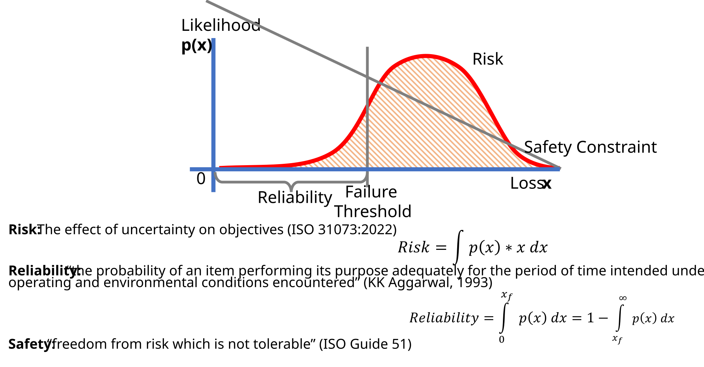
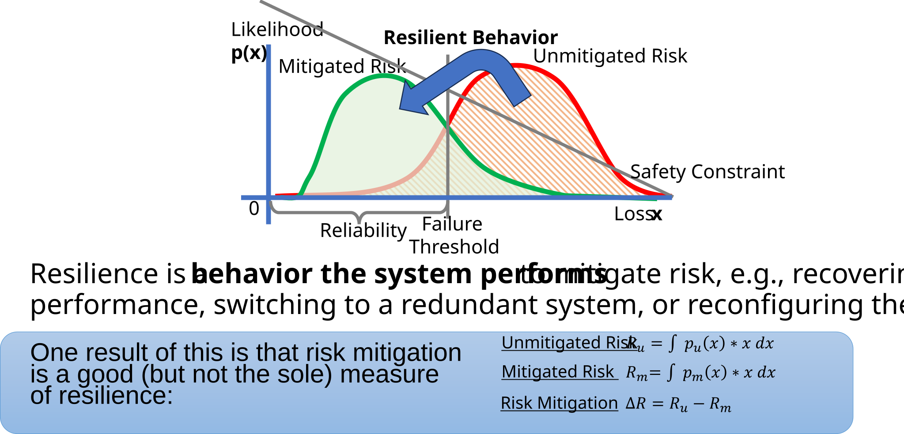
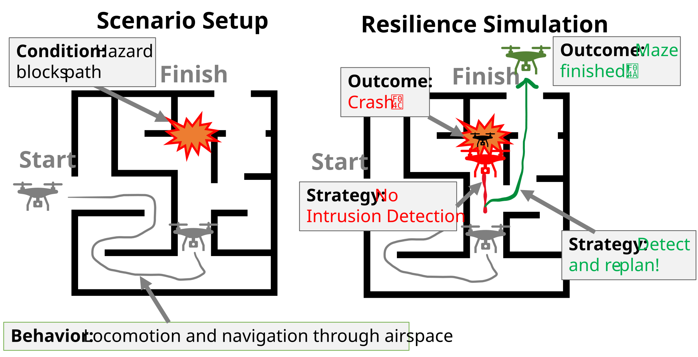
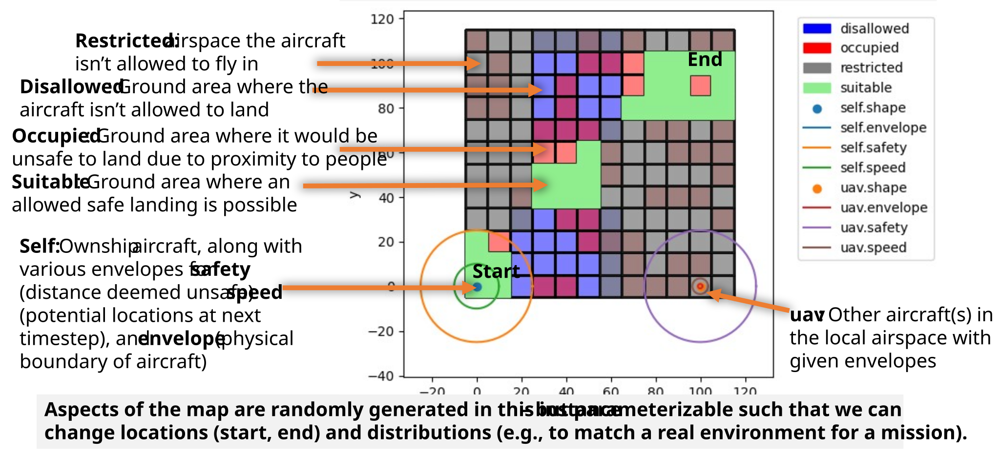

# Resilience Simulation: What and Why
## Why Resilience? {.smaller}

::::: columns
::: {.column width="50%"}
{height=250px}

Engineered systems are "brittle"

:::

::: {.column width="50%"}
{height=250px}

Natural systems "bounce back"
:::
:::::

What if we could adapt to hazardous events so they don’t become catastrophes?

- Disasters and the unpreventable – How do we respond when we can’t preempt?
- Autonomy and new technologies—How do we engineer hazard mitigation?

## What is Resilience? {.smaller}

A widely agreed-upon definition is:

> (The) ability to prepare and plan for, absorb, recover from, and more successfully adapt to adverse events
>
> [National Academies, Policy, Global Affairs, Committee on Science, Public Policy, & Committee on Increasing National Resilience to Hazards. (2012). Disaster resilience: A national imperative. National Academies Press.](https://www.nationalacademies.org/projects/PGA-COSEPUP-09-01/publication/13457)

Key Points:

- Resilience is understood as an ability: Adaptive Capacity
    - e.g., the system can prepare for and/or mitigate given condition(s)
A system can be:
- Resilient to X (specified condition, hazard, scenario, disruption or change etc.)
- Generically resilient—to large numbers of scenarios, unspecified or unknown conditions

## Related Concepts You May Have Heard of 

## Connection of Resilience to Resilience to Risk and Safety

## What's different about resilience?

Resilience is about the dynamics, interactions, and control of hazardous scenarios. 

- Traditional risk and safety processes are generally about **quantifying probability** of "success" versus "failure" and may rely on relatively **simple models** to do so

- Resilience is about navigating the **complex interactions** between system behaviors to improve hazard mitigation via a **variety of metrics** (e.g., recovery, robustness, etc.)

Again, risk, reliability, safety, and resilience are **not mutually exclusive concepts**--the main difference is what the given frameworks emphasize 

## How to think about resilience simulations

A simulation tells us how resilient a system is or can be with a given set of features

> All models are wrong, some are useful
>
> -George Box

Simulation of resilience can be thought of as a game with:
- The behaviors the system is going to embody and how they interact
- The conditions the system is going to operate over
- What is the system’s strategy for dealing with these scenarios?
- What are the good or bad outcomes
- We can call the system more resilient when those strategies improved the outcome(s) 
There may be many metrics to capture this this!

## What does that look like? {.smaller}

Things to consider:

- Our model can be pretty abstract and still give us answers we can use

- There may be multiple places the drone could be blocked!
    - If we really want to know how well this strategy performs overall, we may want to test it in a wide range of scenarios

## How does fmdtools help?

- Representing the complexity required for resilience analysis: by providing flexible, composable modeling paradigm

- Reducing setup costs: By providing built-in analysis and simulation methods

- Providing capabilities aligned with our research on (1) sampling the hazardous state-space, (2) representing human agents in these systems and (3) optimizing model resilience metrics

## Demonstrative Example: Drone Proximity to Threat Evaluation

- Created adaptable domain-specific library that can be used to model aircraft and drones in the airspace

- Focused on safety to collision with other aircraft as well as landing

- Question "How does state awareness of other air threats improve drone resilience to collision?"

- Model at `examples/airspacelib/contingency_management`

## Model Setup

## Simulation - Nominal

## Simulation - Hazards

- Without proximity to threat functionality, drone may fly into errant intruding drone

- Proximity to threat functionality causes a pause in mission as well as mission re-planning

## Conclusion {.smaller}

- Resilience is the capability of a system to actively prevent, mitigate and/or adapt to hazardous and/or anomalous conditions. To evaluate system resilience, we need ways of capturing:
    - How a system’s dynamical behavior(s) intensify or mitigate a given set of hazardous conditions
    - How the system is controlled at a high level, including interactions between its operator/autonomy, physical behaviors, and environment
- Modeling and Simulation gives us the ability to analyze systems resilience to hazardous scenarios
    - Can instantiate wide ranges of scenarios we practically cannot test in the real world or even a more detailed sim
- The fmdtools framework can the foundation for analyzing the resilience of any system of interest
