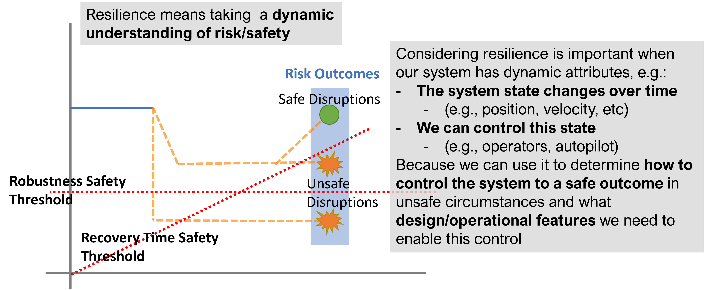

Development Guide
===========================

Why fmdtools?
^^^^^^^^^^^^^^^^^^^^^^^^^^^^^^^^

   
   Resilience is important to consider when dynamics of system behavior can lead to hazardous or unsafe outcomes.

The fmdtools library was developed to study resilience, which is an important consideration in designing safe, low-risk systems. As shown above, the key defining aspect of resilience is the **dynamics of failure events**, which may lead to recovery (or, a safe outcome) or failure (or, an unsafe outcome). 

The main reason fmdtools was developed to study this, was a lack of existing open-source tools to model these dynamics in at a high level (i.e., functions and flows) in the design process. Researchers in this area thus had to re-implement modelling, simulation, and analysis approaches for each new case study or methodological improvement. The fmdtools package resolves this problem by separating resilience modelling, simulation, and analysis constructs from the model under study, enabling reuse of methodologies between case studies. Towards this end, the fmdtools package provides three major pieces of functionality:

1. Model definition constructs which enable systematic early specification of the high level structure and behaviors of a system with concise syntax (:mod:`fmdtools.define`).

2. Simulation methods which enable the quantification of system performance and propagation of hazards over a wide range of operational scenarios and model types (:mod:`fmdtools.sim`).

3. Analysis methods for quantifying resilience and summarizing and visualizing behaviors and properties of interest (:mod:`fmdtools.analyze`).

An overview of an earlier version of fmdtools (0.6.2) is provided in the paper:

`Hulse, D., Walsh, H., Dong, A., Hoyle, C., Tumer, I., Kulkarni, C., & Goebel, K. (2021). fmdtools: A Fault Propagation Toolkit for Resilience Assessment in Early Design. International Journal of Prognostics and Health Management, 12(3). <https://doi.org/10.36001/ijphm.2021.v12i3.2954>`_

Key Features
--------------------------------

fmdtools was developed with a number of unique features that differentiate it from existing safety/resilience simulation tools. 

- fmdtools uses an object-oriented undirected graph-based model representation which enables arbitrary propagation of flow states through a model graph. As opposed to a *procedural* *directed* graph-based model representation (a typical strategy for developing fault models in code in which each function or component is represented by a method, the inputs and outputs are which are connected with connected functions/components in a larger model method), this enables one to:
  
  - propagate behaviors in multiple directions in a model graph, e.g., closing a valve will not just reduce flow in the downstream pipe but also increase pressure in upstream pipes.
  
  - define the data structures defining a function/component (e.g. states, faults, timed events) with the behavioral methods in a single logical structure that can be re-used and modified for similar components and methods (that is, a class, instead of a set of unstructured variables and methods)

- fmdtools can represent the system at varying levels of fidelity through the design process so that one can start with a simple model and analysis and make it more detailed as the design is elaborated. A typical process of representing the system (from less to more detail) would involve:
  
  - Creating a network representation of the model functions and flows to visualize the system and identify structurally-important parts of the model's causal structure
  
  - Elaborating the flow attributes and function failure logic in a static propagation to simulate the timeless effects of faults in the model
  
  - Adding dynamic states and behaviors to the functions as well as a simulation times and operational phases in a dynamic propagation model to simulate the dynamic effects of faults simulated during different time-steps
  
  - Instantiating functions with component architectures to compare the expected resilience and behaviors of each
  
  - Defining stochastic behavioral and input parameters to simulate and analyze system resilience throughout the operational envelope
  
  - Using optimization methods to search the space of potential hazardous scenarios and find the optimal response parameters to mitigate these scenarios

- fmdtools provides convenient methods for quickly visualizing the results of fault simulations with commonly-used Python libraries to enable one to quickly assess:
  
  - effects of faults on functions and flows in the model graph at a given time-step
  
  - the behavior of system states over time in nominal and faulty scenarios over a range of operational parameters
  
  - the effect of model input parameters (e.g., ranges, stochastic inputs) on nominal/faulty operations
  
  - the high-level results of a set of simulations in an FMEA-style table of faults, effects, rates, costs, and overall risk
  
  - simulation responses over a range or distribution of model and scenario parameters

Intro to fmdtools
^^^^^^^^^^^^^^^^^^^^^^^^^^^^^^^^
**The best place to start** to getting acquanted with basic syntax and functionality is the `Intro to fmdtools <Intro_to_fmdtools.md>`_ workshop (:download:`download slides as pdf <Intro_to_fmdtools.pdf>`), which uses the `Pump` example to introduce the overall structure and use of fmdtools. Other models are further helpful to help demonstrate the full variety of methods/approaches supported in fmdtools and their applcation more advanced use-cases.

.. toctree::
   :hidden:
   
   Intro_to_fmdtools.md

Contributions
^^^^^^^^^^^^^^^^^^^^^^^^^^^^^^^^
--------------------------------

Development of fmdtools is coordinated by the `fmdtools team <https://github.com/nasa/fmdtools/blob/main/CONTRIBUTORS.md>`_ at NASA Ames Research Center. As an open-source tool developed under the NASA Open Source Agreement, outside contributions are welcomed. To be able to submit contributions (e.g., pull requests) external contributors should first submit a contributors license agreement (`Individual CLA <https://github.com/nasa/fmdtools/blob/main/fmdtools_Individual_CLA.pdf>`_ , `Corporate CLA <https://github.com/nasa/fmdtools/blob/main/fmdtools_Corporate_CLA.pdf>`_).

Repo Structure
--------------------------------

.. image:: /docs/figures/repo_structure.svg
   :width: 800
   
Getting started with development first requires some basic familiarity with the repo structure, shown above. As shown, the repo contains:
- ``/fmdtools``, which is where the toolkit sub-packages and modules are held
- ``/tests``, which has tests of the modules
- ``/examples``, which are different case study examples 
- ``/docs``, which contains documentation

There are additionally a few scripts with specific purposes to serve the development process:
- ``run_all_tests.py`` which is a script that runs tests defined in `/tests` and `/examples`
- ``setup.py``, which is used for building PyPI packages, and 
- ``MAKE``, which is used to build the sphinx documentation.

Remote Structure
********************************

.. image:: /docs/figures/git_structure.svg
   :width: 800

Development of fmdtools uses a two-track development model, in which contributions are provided within NASA as well as by external collaborators. To support this, there are multiple repositories which must be managed in the development process, as shown above. Essentially, there is:

- An internal bitbucket, where NASA coordination and development takes place,
- A public GitHub, where collaboration with outside developers takes place (and where documentation is hosted), and 
- A PyPI repository which contains stable versions of fmdtools which can be readily installed via ``pip``.

The fmdtools team is responsible for coordinating the development between the internal and external git repositories. Managing multiple repositories can best be coordinated by:
- setting up multiple remotes on a single git repo on your machine using `git remote`
- propagating changes between repositories during development using `git push` and `git pull` from each repository

Development Process
--------------------------------

.. image:: /docs/figures/dev_process.svg
   :width: 800

To encourage code quality we follow the general process above to manage contributions:

1. Development begins on a ``/dev`` branch for a given version of fmdtools. This branch is used to test and integrate contributions from multiple sources.
2. The first step in making a contribution is then to create an issue, which describes the work to be performed and/or problem to be solved. 
3. This issue can then be taken on in an issue branch (or repo for external contributions) and fixed. 
4. When the contributor is done with a given fix, they can submit a pull request, which enables the review of the fix as a whole.
5. This fix is reviewed by a member of the fmdtools team, who may suggest changes. 
6. When the review is accepted, it is merged into the ``dev`` branch.
7. When all the issues for a given version are complete (this may also happen concurrently with development), tests and documentation are updated for the branch. If tests don't pass (or are obsolete), contributions may be made directly on the ``dev`` branch to fix it, or further issues may be generated based on the impact of the change.
8. When the software team deems the release process to be complete, the ``dev`` branch may be merged into the `main` branch. These branches are then used to create releases. 

The major exceptions to this process are:

- bug fixes, which, if minor, may occur on ``main``/``dev`` branches (or may be given their own branches off of ``main``)
- external contributions, which are managed via pull request off of ``main`` (or some external dev branch)
- minor documentation changes

When releasing fmdtools, the following checklist should be followed:

.. list-table:: Title
   :widths: 10 50 10 30
   :header-rows: 1
    * - Step
      - Description
      - Complete?
      - Comment
    * - 1
      - Sync all appropriate (internal and external) main/dev branches into the release branch
      - 
      - 
    * - 2
      - Run the test script run_all_tests.py and verify test results are appropriate for release
      - 
      - 
    * - 3
      - Update all version numbers in the appropriate files (conf, LICENSE, README, etc)
      - 
      - 
    * - 4
      - Update all version numbers, including README.md, setup,py, LICENSE, Intro_to_fmdtools.md. (this can be done by searching all files)
      -
      -
    * - 5
      - Generate the documentation using `make`  (see Documentation section)
      - 
      - 
    * - 6
      - Tag the branch in git with the appropriate version (e.g., ``git tag -a v2.X.X -m "version 2.x.x"``)
      - 
      - 
    * - 7
      - Sync ``main`` branches between the internal and github remotes and push new generated documentation to ``gh-pages``
      - 
      - 
    * - 8 
      - `Create a release in GitHub <https://github.com/nasa/fmdtools/releases/new>`_ that incorporates (1) a narrative summary of features and changes in the release and (2) the auto-generated release notes corresponding to the issues in bitbucket.
      - 
      - 
    * - 9 
      - If the release is a "stable" release, generate the PyPI package using wheel and twine and upload it to PyPI
      - 
      - 
    * - 10
      - Update/check external CI resources as needed (if not automatically). e.g., CodeFactor.
      -
      -

Upload to PyPI
********************************

Note: Performing this process requires an account with the Python Package Index and Owner/Maintainer status in the fmdtools repository. Presently, this repository is owned by Daniel Hulse and setup should be coordinated with him.  

Note: Performing this process also requires a twine setup. For full instructions, see: https://www.geeksforgeeks.org/how-to-publish-python-package-at-pypi-using-twine-module/  

Once this is set up, the code and be built and uploaded using the following commands in powershell from the repository folder::

	python -m build 
	python -m twine check dist/* 
	python -m twine upload –repository pypi dist/*  

Note: when performing for the first time, it may be helpful to use the test python repo (substitute testpypi for pypi) first—an account is required however. 

Note: make sure that there are no old versions in `dist/`

After upload, test the deployment by: 

1. Spot-checking the online repo (e.g., has the version updated?) 

2. Updating the package (``pip install –upgrade pip``) and

Roles
--------------------------------

- team lead: 		coordinates all activities and has technical authority over project direction
- full developer: 	can make changes off of version and main branches and has full ability to perform the release process
- contributor: 		creates issues and develops off of issue branches

Documentation
--------------------------------

Documentation is generated using Sphinx, which generates html from rst files. The process for generating documentation (after sphinx has been set up) is to open powershell and run::
	
	cd path/to/fmdtools
	./make clean
	./make html

Note that sphinx requires the following requirements, which should be installed bepforehand::

	nbsphinx
	myst_parser
	sphinx_rtd_theme
	pandoc

Pandoc must be installed with anaconda (i.e., using `conda install pandoc`) since it is an external program.

Style/Formatting
--------------------------------

Generally, we try to follow PEP8 style conventions. To catch these errors, it is best to *turn on PEP8 style linting* in your IDE of choice.

Style conventions can additionally be followed/enforced automatically using the Black code formatter. See resources:

- stand-alone formatter: https://github.com/psf/black
- VSCode Extension: https://marketplace.visualstudio.com/items?itemName=ms-python.black-formatter
- Spyder workflow: https://stackoverflow.com/questions/55698077/how-to-use-code-formatter-black-with-spyder

Testing
--------------------------------

There are two major types of tests:

- quantitative tests, which are testing running ``run_all_tests.py``, and
- qualitative tests, which are the example notebooks

Contributors
--------------------------------

See: `CONTRIBUTORS.md <../CONTRIBUTORS.md>`_

.. toctree::
   :hidden:
   
   ../CONTRIBUTORS.md

Model Development Best Practices
^^^^^^^^^^^^^^^^^^^^^^^^^^^^^^^^

Pay attention to and document the fmdtools version
--------------------------------

As a research-oriented tool, much of the fmdtools interfaces can be considered to be "in development." While we have wanted to keep the repository stable, there have been many changes to syntax over the years to provide enhanced functionality and usages.

As such, it can be helpful to document what fmdtools version you are running in a README.md for your project, so you can always have a working model and replicate results, even if something has changed on the toolkit-level. 

This also helps us (as developers) address bugs which affect specific versions of fmdtools, as well as identify bugs which were introduced in updates.

Plan your model to avoid technical debt
--------------------------------

Simple, small models are relatively easy to define in fmdtools with a few functions, flows, and behaviors. As such, it can be easy to get in the habit of not planning or organizing development in a systematic, which leads to issues when developing larger models: specifically, code that is *written into existence* instead of designed, planned, edited, tested, and documented. This leads to `Technical debt <https://en.wikipedia.org/wiki/Technical_debt>`_, which is the inherent difficulty of modifying code that was written ad-hoc rather than designed. Unless this technical debt is resolved, the ability to modify a model (e.g., to add new behaviors, conduct analyses, etc) will be limited by the complicated and unwieldy existing code. 

The next subsections give some advice to help avoid technical debt, based on lessons learned developing fmdtools models over the past few years.

Don't copy, inherit and functionalize
--------------------------------
Copy-and-paste can be a useful concept, but often gets over-relied upon by novice model developers who want to create several variants of the same programming structure. However, in the world of systems engineering (and software development), there are many cases where developers should be using `class inheritance <https://www.w3schools.com/python/python_inheritance.asp>`_ and `writing functions <https://ucsbcarpentry.github.io/2019-10-10-Python-UCSB/14-writing-functions/>`_ instead. 

The advantages of inheritance are: 

#. it reduces the bulk amount of code required to represent functions, making code more comprehensible
#. it makes the distinction between similar classes easier to distinguish, since *there is no redundant code*
#. it makes it easier to edit code afterward, since the developer *only has to edit in one place* for it to apply to all the relevant types
#. it makes testing easier, since common methods only need to be tested once

In fmdtools, these patterns can be helpful:

* Instead of creating two very similar :class:`fmdtools.define.FxnBlock` classes (e.g. Drone and PilotedAircraft) and copying code between each, create a single class (e.g. Aircraft) with common methods/structures (e.g., Fly, Taxi, Park, etc.) and then use sub-classes to extend and/or replace methods/structures the common class as needed (e.g., Autonomous Navigation in the Drone vs. Piloted Navigation in the normal aircraft).
* In a :class:`fmdtools.define.Model` definition, instead of having several flow dictionaries with similar/the same data inputs, define one dictionary at the beginning and use it in each of the :meth:`fmdtools.define.Model.add_flow` methods.
* Instead copying code for the same operations to several different places in a model, write a single function instead. This method can then be documented/tested and extended to a variety of different use-cases which require the same basic operation to be done. 

This is an incomplete list. In general, it can be a helpful limitation to *try to avoid using copy-and-paste as much as possible.* Instead if a piece of code needs to be run more than once in more than once place, write a function or method which will be used everywhere. The idea should be to *write the code once, and run it everywhere.*

Document your code, sometimes *before* your write it
--------------------------------

In general, Python coding style aspires to be `as self-documenting <https://en.wikipedia.org/wiki/Self-documenting_code>`_ as possible. However, this is not a replacement for documentation. In general, novice developers think of documentation as something which happens at the end of the software development process, as something to primarily assist users. 

This neglects the major benefits of documentation in the development process. Specifically:

#. It helps other people understand how to use and *contribute to* your code,
#. It helps define what your code is supposed to do, its interfaces, and the desired behavior, and
#. As a result, it helps you understand your code.

For fmdtools models, documentation should at the very least take the following form:

* A README (in markdown or rst) that explains how to set up the model environment (e.g., requirements/dependencies), as well as explains the structure of the folder/repo (model file, tests, analyses, etc.)
* Documented examples of using the code. Usually you can use a jupyter notebook for this to show the different analyses you can run with your model.
* Docstrings which document the classes and functions which make up your model. These are most important for development and should include:
	* An overall module description (top of file)
	* Docstrings for flows: What does the state represent? What are the states? What values may these take?
	* Docstrings for :class:`fmdtools.define.FxnBlock`: What are the states, parameters, behaviors, and modes?
	* For any method/function, try to follow existing docstring conventions, with a summary of the purpose/behavior of the method, and a description of all input/output data types.

Documentation can best be thought of as a *contract that your code should fulfill*. As such, it can be very helpful to think of the documentation first, as a way of specifying your work. Tests (formal and informal) can then be defined based on the stated behavior of the function. It is thus recommended to *document your code as you write it*, instead of waiting until the end of the development process, to avoid technical debt. 

Don't get ahead of yourself--try to get a running simulation first
--------------------------------

In the model development process, it can often be tempting to try to model every single mode or behavior in immense detail from the get-go. This is motivated by a desire to acheive realism, but can lead to issues from a project management and integration perspective. A model does not have much meaning outside a simulation or analysis, and, as such, development needs to be motivated *first* by getting a working simulation and *then* by adding detail. These simulations are the key feedback loop for determining whether model code is embodying desired behavior. 

A very basic model development process should thus proceed:

#. Create model file and create place-holder major function/flow classes
#. Connect classes in a model file and visualize structure
#. Create low-fidelity model behaviors and verify in nominal scenario
#. Add hazard metrics in `find_classification` 
#. Add more detailed behaviors (e.g., modes, actions, components, etc) as needed
#. Perform more complex analyses...

In general, it is bad to spend a lot of time developing a model without running any sort of simulation for verification purposes. This toolkit has been designed to enable the use of simulations early in the development process, and it is best to use these features earlier rather than later.

Finally, *smaller, incremental iterations are better than large iterations.* Instead of spending time implementing large sections of code at once (with documentation and testing TBD), instead implement small sections of code that you can then document, test, and edit immediately after. Using these small iterative cycles can increase code quality by ensuring that large blocks of undocumented/untested (and ultimately unreliable) code don't make it into your project, only for you to have to deal with it later.

Preserve your prototype setup by formalizing it as a test
--------------------------------

Testing code is something which is often neglected in the development process, as something to do when the project is finished (i.e., as an assurance rather than development task). Simultaneously, developers often iterate over temporary scripts and code snippets during development to ensure that it works as expected in what is essentially an informal testing process. The major problem with this process is that these tests are easily lost and are only run one at a time, making it difficult to verify that code works after it has been modified.

Instead, it is best to *formalize scripts into tests*. This can be done with Python's `unittest <https://docs.python.org/3/library/unittest.html>`_ module, which integrates well with existing python IDEs and enables execution of several different tests in a sequence. Instead of losing prototype code, one can easily place this code into a `test_X` method and use it iteratively in the development process to ensure that the code still works as intended. This is true even for more "qualitative" prototype script, where the output that is being iterated over is a plot of results. Rather than abandoning a prototyping setup like this, (e.g., by commenting it out), a much better approach is to formalize the script as a test which can be run at the will of the user when desired. In this case, the plot should show the analysis and describe expected results so that it can be quickly verified. The testing of plots is enabled with the function :func:`fmdtools.analyze.plot.suite_for_plots`, which enables you to filter plotting tests out of a model's test suite (or specify only running specific tests/showing specific plots). 

While testing is an assurance activity, it should also be considered a development activity. Testing ensures that the changes made to code don't cause it to take on undesired behaviors, or be unable to operate with its interfacing functions. To enable tests to continue to be useful through the modelling process, they should be given meaningful names as well as descriptions describing what is being tested by the test (and why).

Finally, don't create tests solely to create tests. Tests should have a specific purpose in mind ideally single tests should cover as many considerations as possible, rather than creating new tests for each individual consideration. As in model development, try to avoid bloat as much as possible. If the desire is to cover every edge-case, try to parameterize tests over these cases instead of creating individual test methods.

Edit your code
--------------------------------

The nature of writing code is a messy process--often we spend a considerable amount of time getting code to a place where it "works" (i.e., runs) and leave it as-is. The problem with doing this over and over is that it neglects the syntax, documetation, and structural aspects of coding and thus contributes to technical debt. One of the best ways to avoid this from impacting development too much is to edit code after writing it.

Editing is the process of reviewing the code, recognizing potential (functional and stylistic) problems, and ultimately revising the code to resolve these problems. In this process, all of the following concerns should be considered:

* Do the data structures make logical sense? Are they used systematically throughout the project?
* Are operations organized with a logical structure? Is it easy to see what is performed in what sequence? Are lines too long? 
* Are naming and stylistic conventions being followed? Do variables have self-explanatory names? Are names being spelled correctly?
* Are lines too long? Are there too many nested statements?
* Are the methods/classes fully documented? 
* Will the functions work in every possible case implied by the documentation?
* Is inheritance being used correctly? 
* Is the code re-inventing existing fmdtools structure or syntax or going against existing protocols?
* Does it pass all tests?

This is an incomplete list. The point is to regularly review and improve code *after it is implemented to minimize future technical debt*. Waiting to edit will cause more hardship down the line.

Structuring a model
--------------------------------

fmdtools was originally developed around a very simple use-case of modelling physical behaviors using a Function/Flow ontology, where Functions (referred to as "technical functions") are supposed to be the high-level roles to be performed in the system, while flows are the data passed between these roles (energy, material, or signal).  Many of the models in the repository were developed to follow this form, or some variation on it, however, more complex modelling use-cases have led us to need to expand our conception of what can/should be modelled with a function or flow. More generally, 
- Flows define *shared data structures*, meaning interacting variables
- Functions define *behaviors*, meaning things to be done to flows.

These functions and flows are connected via containment relationships in an undirected graph, meaning that functions can be run in any order within a time-step to enable faults to propogate throughout the model graph. This is a very general representation, but also leads to pit-falls if the model is too complex, since this behavior needs to be convergent within each timestep. The following gives some advice for conventions to follow in models based on their size/scope.

**Small Models**

Small models have a few functions with simple behaviors that are being loaded in simple ways. A good example of this is the `Pump Example <../examples/pump/Pump_Example_Notebook.ipynb>`_ and `EPS Example <../examples/eps/EPS_Example_Notebook.ipynb>`_ , where the model is a simple translation of inputs to (defined in input functions) outputs (defined in output functions. These models have the most ability to follow the functional basis modelling ontology (with `import_x` loadings and `output_x` outputs) , as well as use static_behavior methods. It is also possible to model many different modes with full behavioral detail, since the system itself is not too complicated. Technical debt and development process is less of a consideration in these models, but should still not be ignored. A typical structure for a model would be:

* Model
	* flows
		* X
		* Y
	* functions
		* Import_X
		* Change_X_to_Y
		* Export_Y

**System Models**

Moderate-size system models are models which have a control/planning system (e.g., something that tells it what to do at any given time). They also often interact with their environment in complex ways. A typical structure for a model would be: 

* Model
	* flows
		* Environment, Location, etc 		(place the system is located in and its place in it)
		* Power, Actions, etc				(internal power/other physical states)
		* Commands,Communications, etc 	(external commands/comms with an operator)
	* functions
		* Affect_Environment 				(Physical behaviors the system performs on the environment)
		* Control_System 					(Controls, Planning, Perception, etc)
		* Distribute_Energy, Hold_X, etc 	(Internal components, etc)

A good example of this are the Drone and Rover models. Models like this are simply more complex and thus require more care and attention to avoid the accumulation of technical debt. It may be desireable for some of the more complex functions to be specified tested in isolation, and developed in their own files. Finally, flows such as `Environment` may require developing custom visualization methods (maps, etc) to show the how the system interacts with its environment.

**System of Systems Models**

Systems of Systems models involve the interaction of multiple systems in a single model. These models are much more complex and thus require very good development practices to develop to maturity. A typical structure for a model for this might be:

* Model
	* flows
		* Environment						(place the systems are located in)
		* Location(s)						(individual states of the agents)
		* Communication(s) 				(agent interactions with each other
	* functions
		* Asset/Agent(s)					(individual system models)
		* AgentController(s)				(coordinator which issues commans to each system)

Note that, unlike other model types, System of Systems models very often will have multiple copies of functions and flows instantiated in the model. As a result, it is important to use dedicated model structures to the overall structure from being intractible. Specifically multiple copies of flows can be handled using the `MultiFlow` class while Communications between agents can be handled using the `CommsFlow` class. The `ModelTypeGraph` graph representation can be used to represent the model as just the types involved (rather than all instantiations). In general, it can be helpful to create tests/analyses for individual agents in addition to the overall system.

Use model constructs to simplify your code
--------------------------------
The fmdtools codebase is quite large, and, as a result, it can be tempting to dive into modelling before learning about all of its capabilities. The problem with this is that many of these capabilities and interfaces are there to make your life easier, provided you understand and use them correctly. Below are some commonly-misunderstood constructs to integrate into your code:

* :class:`fmdtools.define.Common` has a number of very basic operations which can be used in all model structures to reduce the length of lines dedicated solely to assignment and passing variables between constructs. Using these methods can furthermore enable one to more simply perform vector operations with reduced syntax.
* :class:`fmdtools.define.Timer` can be used very simply using to represent timed behavior and state-transitions 
* While modes can be used to describe fault modes in a very general way, faulty behavior that can also be queried from the model using the concept of a *disturbance*, which is merely a change in a given variable value. While disturbances are less general, they requie much less to be implemented in the model.
* parameters and parameter-generating functions are helpful for understanding the model operating envelope. In general, try to avoid having parameters that duplicate each other in some way.
* Randomness can be used throughout, but use the specified interfaces (`seed`, :meth:`fmdtools.define.Block.assoc_rand_states`, etc.) so that a single seed is used to generate all of the rngs in the model. Not using these interfaces can get you in trouble.
* A variety of custom attributes can be added to :class:`fmdtools.define.FxnBlock` and :class:`fmdtools.define.Flow`, but not every custom attribute is going to work with staged execution and parallelism options. In general, all function constructs that change should be `states`, while parameters may be attributes. If you want to do something fancy with data structures, you may need to re-implement :class:`fmdtools.define.FxnBlock` methods for copying and returning states to `propagate`.
* If there's something that you'd like to do in an fmdtools model that is difficult with existing model structures, consider filing a bug report before implementing you own ad-hoc solution. Alternatively, try devoping your solution as a *feature* rather than a hack to solve a single use-case. If the features is in our scope and well-developed, we may try to incorporate it in our next release.

Style advice
--------------------------------

Development of fmdtools models should follow the `PEP 8 Style Guide <https://peps.python.org/pep-0008/#introduction>`_ as much as possible. While this won't be entirely re-iterated here, the following applies:

* Use CamelCase for classes like :class:`fmdtools.define.Model`, :class:`fmdtools.define.FxnBlock`, :class:`fmdtools.define.Flow`, :class:`fmdtools.define.Component`, etc. Use lowercase for object instantiations of these classes, and lower_case_with_underscores (e.g. do_this()) for methods/functions.
	* if a model class is named Model (e.g., Drone), the instance should be named model_X, where X is an identifying string for the model being used (e.g. drone_test). 
* Names should be descriptive, but keep the length down. Use abbreviations if needed.
* Try to use the code formatting structure to show what your code is doing as much as possible. Single-line if statements can be good for this, as long as they don't go too long.
* Python one-liners can be fun, but try to keep them short enough to be able to read. 
* If a file is >1000 lines, you may want to split it into multiple files, for the model, complex classes, visualization, analysis, tests, etc.
* fmdtools lets you specify names for functions/flows. Keep these consistent with with the class names but consider making them short to enable visualization on model graphs and throughout the code.
* It's `fmdtools`. Not `Fmdtools` or `fmd tool`. Even when it starts the sentence.

See also
--------------------------------

* `PEP 8 Style Guide <https://peps.python.org/pep-0008/#introduction>`_
* `Technical debt <https://en.wikipedia.org/wiki/Technical_debt>`_
* `Code smell <https://en.wikipedia.org/wiki/Code_smell>`_
* `Anti-patterns <https://en.wikipedia.org/wiki/Anti-pattern>`_
* `Iterative development <https://en.wikipedia.org/wiki/Iterative_and_incremental_development>`_
* `Python Programming Idioms <https://en.wikibooks.org/wiki/Python_Programming/Idioms>`_
* `The Zen of Python <https://en.wikipedia.org/wiki/Zen_of_Python>`_