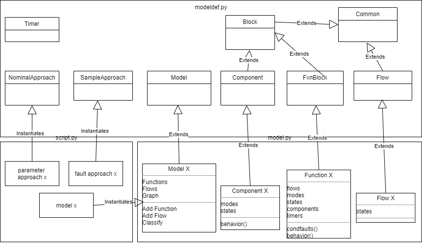

# Fault Modelling in fmdtools

---

# Agenda

1. Package Overview
	- Structure, functions and classes, and usage paradigm
2. Basic Tutorial
	- Walkthrough of Pump example
---

# Goals

What are we trying to do with a fault model?

- Find out how a fault in one subsystem will affect the rest of the system (propagation)

- Find out how a system will behave over time as a result of a fault (dynamic propagation)

- Quantify risks resulting from faults
	- occurence rate
	- severity

- Visualize important faults and failure mechanisms

- Increase system resilience

- ...

- **Understand and Mitigate Risk in the System**

---

# The fmdtools package

- fmdtools.modeldef: classes for defining a model 
	- e.g. functions, flows, etc.
- fmdtools.faultprop: functions to propogate faults in a model 
	- e.g. inject a fault or set of faults
- fmdtools.resultproc: functions to process results 
	- e.g. tables, visualizations, etc.
	
---

# What is a model? What is propagation?

At its most basic, a model is an object with function objects connected by flow objects. 

- Function objects have:
	- States
	- Associated Flows
	- Faults
	- Components (optionally)
	- and *Behavior* methods
- Flows have states
- Components have:
	- States
	- Faults
	- Behavior

In addition, Models have:
- A graph object to map the connections between functions/flows
- A classify() method to evaluate how severe a fault scenario was based on the faults and states the model took.
- ...
- (and more!)

---

# Propagation

- Two aspects of fault propagation:
	- Static propagation: How a fault immediately changes the states of the system
	- Dynamic propagation: How the states evolve over time as a result
---

# Static Propagation

- Note: In order for this propogation to work, the states of the system must settle to some stable end-state--otherwise propogation will just keep going!

---

# Dynamic Propagation

Iteratively re-run static propagation over a set of discrete time-steps until the simulation is over.

---

# Putting it all together

Putting it all together means dynamically propogating a *set* of faults for the whole system over a *set* of times 

---

# General Workflow

1.) Define a model

	- python file referencing the modeldef modules
	
	- create needed function, flow, model, and component classes for model
	
2.) Propagate Faults

	- python script/jupyter notebook using the model file and faultprop module
	
	- instantiate model
	
	- instantiate sample approach for model (if used)
	
	- run appropriate faultprop function
	
3.) Process/Visualize/Quantify Results

	- (same python script)
	
	- use the function(s) corresponding to the analysis/visualization desired
	
		- use compare_hists() if needed for the above functions
		
In this, we'll reference the tutorial in /pump example/

---

# Defining a Model

- Define model using the appropriate modeldef superclasses.

---

# Defining Functions

Three methods to define: init(), condfaults(), behavior()

## init: Initializes model object

- (make sure to instance FxnBlock)
- call superclass init()
	- flownames: names of each flow corresponding to flows to be used internally in the function
	- flows: flows associated with the function
	- states: (optional) Internal states of the function (a dict with name:initvalue)
	- timers: (optional) Set of names for timers to use in the function
- define a failure rate for the function (self.failrate = )
- add failure modes using self.assoc_modes():
	- input is dict with structure: 
	- {`name`:[distribution (fail rate fraction), [weightings for each phase], repaircost]}

## condfaults: defines how faults occur in the function as a result of input states

- Generally, a set of if/else statements. (arbitrarily definable)
- Note that all variables here have the names given in init!
	- e.g. self.timer = name of timer defined in init, Watout is the name given in flownames!
- faults added using self.add_fault('faultname') or other method

## behavior: defines how the function behaves

- Arbitrarily definable, but best organized into two parts: 
	- if/else statements for what happens if there is a fault
		- here we use self.has_fault('faultname') to check
	- equations relating inputs to outputs and vice-versa
		- here muliplication is used to propogate states, where a nominal state = 1 and failed states are 0 and inf
		- though other relationships can be used instead--there is no reason the real equations of state cannot be included here
---

# Defining Model Class
Two methods to define: init and find_classification()

## init 

- Instance superclass
- Define operational phases
- Define a timestep

- add flows
	- use self.add_flow()
	- argument: flowname, flowtype, and either
		- a dict of {statenames:values}, or
		- a custom flow class to instance defined in the file

- add functions
	- use self.add_fxn()
	- argument: functionname, function Class, flows (a vector with the names of the flows going in to/out of the function)
		- note that the names in flows correspond to the string names in add_flow but must be in the same order as the flownames defined in the function class
- construct graph using self.construct_graph

## find_classification()

- input is the results graph, faults in the end-state of the system, values of the end flows, scenario parameters, and the history of the model states
- code is arbitrarily definable, below we calculate a few costs for the scenario

- three required outputs:
	- rate (scen[properties][rate])
	- cost (calculated here)
	- expected cost (rate*cost*life)

---

# Propagation and Results Processing

see pump example/Simple Pump Example.ipynb for the rest of the tutorial!