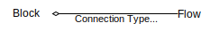
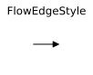
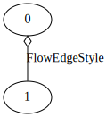
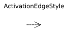
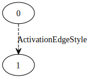
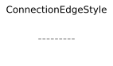
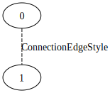

fmdtools.analyze.graph 
===========================
.. automodule:: fmdtools.analyze.graph

The graph sub-package is used to graphically represent models and has the following modules:

.. autosummary::

    fmdtools.analyze.graph.label
    fmdtools.analyze.graph.style
    fmdtools.analyze.graph.base
    fmdtools.analyze.graph.architecture
    fmdtools.analyze.graph.flow

fmdtools.analyze.graph.label
--------------------------------

.. automodule:: fmdtools.analyze.graph.label
   :members:
   :undoc-members:
   :show-inheritance:

fmdtools.analyze.graph.style
--------------------------------

The style module defines graph attributes (nodes and edges) are visually represented as a part of an overall diagram.

Generally, it is the intent of fmdtools to comply with the :term:`FRDL` specification as much as possible, however, graphviz and networkx limit our ability to comply fully. Below we show how each :term:`FRDL` construct is visually represented in fmdtools:

.. |frdl_activ| image:: ../docs/figures/frdl/frdl_activation.svg

.. |frdl_prop| image:: ../docs/figures/frdl/frdl_propagation.svg

**Edges**

 +--------------------+----------------+-----------+-----------+
 | Construct          +  FRDL          + graphviz  + networkx  |
 +--------------------+----------------+-----------+-----------+
 | Flow Connection    + |frdl_flowcon| + |gv_flowc|+ |nx_flowc||
 +--------------------+----------------+-----------+-----------+ 
 | Activation         + |frdl_activ|   + |gv_activ|+|nx_activ| |
 +--------------------+----------------+-----------+-----------+ 
 | Flow Propagation   + |frdl_prop|    +    N/A    +  N/A      |
 +--------------------+----------------+-----------+-----------+ 
 | Weak Connection    + N/A            + |gv_conn| + |nx_conn| |
 +--------------------+----------------+-----------+-----------+ 
 
 .. |frdl_flow| image:: ../docs/figures/frdl/frdl_flow.svg
 .. |nx_flow| image:: ../docs/figures/frdl/nx_flow.svg
 .. |gv_flow| image:: ../docs/figures/frdl/gv_flow.svg
 .. |frdl_mflow| image:: ../docs/figures/frdl/frdl_multiflow.svg
 .. |nx_mflow| image:: ../docs/figures/frdl/nx_multiflow.svg
 .. |gv_mflow| image:: ../docs/figures/frdl/gv_multiflow.svg
 .. |frdl_cflow| image:: ../docs/figures/frdl/frdl_commsflow.svg
 .. |nx_cflow| image:: ../docs/figures/frdl/nx_commsflow.svg
 .. |gv_cflow| image:: ../docs/figures/frdl/gv_commsflow.svg
 .. |frdl_fxn| image:: ../docs/figures/frdl/frdl_function.svg
 .. |nx_fxn| image:: ../docs/figures/frdl/nx_function.svg
 .. |gv_fxn| image:: ../docs/figures/frdl/gv_function.svg
 .. |frdl_act| image:: ../docs/figures/frdl/frdl_action.svg
 .. |nx_act| image:: ../docs/figures/frdl/nx_action.svg
 .. |gv_act| image:: ../docs/figures/frdl/gv_action.svg
 .. |frdl_com| image:: ../docs/figures/frdl/frdl_component.svg
 .. |nx_com| image:: ../docs/figures/frdl/nx_component.svg
 .. |gv_com| image:: ../docs/figures/frdl/gv_component.svg
 .. |nx_con| image:: ../docs/figures/frdl/nx_container.svg
 .. |gv_con| image:: ../docs/figures/frdl/gv_container.svg
 .. |nx_arch| image:: ../docs/figures/frdl/nx_architecture.svg
 .. |gv_arch| image:: ../docs/figures/frdl/gv_architecture.svg
 
 **Nodes**
 
 +--------------------+----------------+-----------+-----------+
 | Construct          +  FRDL          + graphviz  + networkx  |
 +--------------------+----------------+-----------+-----------+
 | :term:`Flow`       + |frdl_flow|    + |gv_flow| + |nx_flow| |
 +--------------------+----------------+-----------+-----------+ 
 | :term:`MultiFlow`  + |frdl_mflow|   + |gv_mflow|+ |nx_mflow||
 +--------------------+----------------+-----------+-----------+  
 | :term:`CommsFlow`  + |frdl_cflow|   + |gv_cflow|+ |nx_cflow||
 +--------------------+----------------+-----------+-----------+ 
 | :term:`Function`   + |frdl_fxn|     + |gv_fxn|  + |nx_fxn|  |
 +--------------------+----------------+-----------+-----------+ 
 | :term:`Action`     + |frdl_act|     + |gv_act|  + |nx_act|  |
 +--------------------+----------------+-----------+-----------+
 | :term:`Component`  + |frdl_com|     + |gv_com|  + |nx_com|  |
 +--------------------+----------------+-----------+-----------+
 | Container          +  N/A           + |gv_con|  + |nx_con|  |
 +--------------------+----------------+-----------+-----------+  
 | Architecture       + N/A 	       + |gv_arch| + |nx_arch| |
 +--------------------+----------------+-----------+-----------+  

.. automodule:: fmdtools.analyze.graph.style
   :members:
   :undoc-members:
   :show-inheritance:

fmdtools.analyze.graph.base
--------------------------------

.. automodule:: fmdtools.analyze.graph.base
   :members:
   :undoc-members:
   :show-inheritance:

fmdtools.analyze.graph.architecture
--------------------------------

.. automodule:: fmdtools.analyze.graph.architecture
   :members:
   :undoc-members:
   :show-inheritance:

fmdtools.analyze.graph.flow
--------------------------------

.. automodule:: fmdtools.analyze.graph.flow
   :members:
   :undoc-members:
   :show-inheritance:
