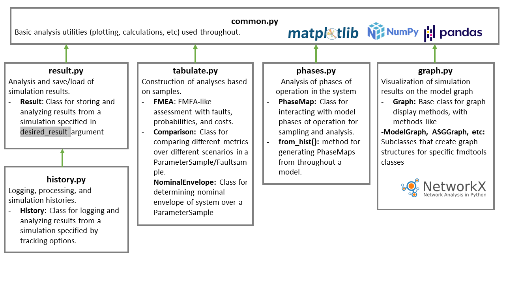

fmdtools.analyze
===========================
.. automodule:: fmdtools.analyze

The analyze package is organized into the modules:

.. autosummary::

	fmdtools.analyze.common
	fmdtools.analyze.result
	fmdtools.analyze.history
	fmdtools.analyze.graph
	fmdtools.analyze.tabulate
	fmdtools.analyze.phases

The model reference for each of these is provided below:

fmdtools.analyze.common
-------------------------------

.. automodule:: fmdtools.analyze.common
   :members:
   :undoc-members:
   :show-inheritance:

fmdtools.analyze.result 
--------------------------------

.. automodule:: fmdtools.analyze.result
   :members:
   :undoc-members:
   :show-inheritance:

fmdtools.analyze.history
--------------------------------

.. automodule:: fmdtools.analyze.history
   :members:
   :undoc-members:
   :show-inheritance:

fmdtools.analyze.graph 
--------------------------------

The graph sub-package is used to graphically represent models and has the following modules:

.. autosummary::

    fmdtools.define.graph.style
    fmdtools.define.graph.base
    fmdtools.define.graph.architecture
    fmdtools.define.graph.flow

fmdtools.analyze.graph.style
+++++++++++++++++++++++++++++++++++

.. automodule:: fmdtools.analyze.graph.style
   :members:
   :undoc-members:
   :show-inheritance:

fmdtools.analyze.graph.base
+++++++++++++++++++++++++++++++++++

.. automodule:: fmdtools.analyze.graph.base
   :members:
   :undoc-members:
   :show-inheritance:

fmdtools.analyze.graph.architecture
+++++++++++++++++++++++++++++++++++

.. automodule:: fmdtools.analyze.graph.architecture
   :members:
   :undoc-members:
   :show-inheritance:

fmdtools.analyze.graph.flow
+++++++++++++++++++++++++++++++++++

.. automodule:: fmdtools.analyze.graph.flow
   :members:
   :undoc-members:
   :show-inheritance:

fmdtools.analyze.tabulate 
-----------------------------------

.. automodule:: fmdtools.analyze.tabulate
   :members:
   :undoc-members:
   :show-inheritance:

fmdtools.analyze.phases
-----------------------------------

.. automodule:: fmdtools.analyze.phases
   :members:
   :undoc-members:
   :show-inheritance: