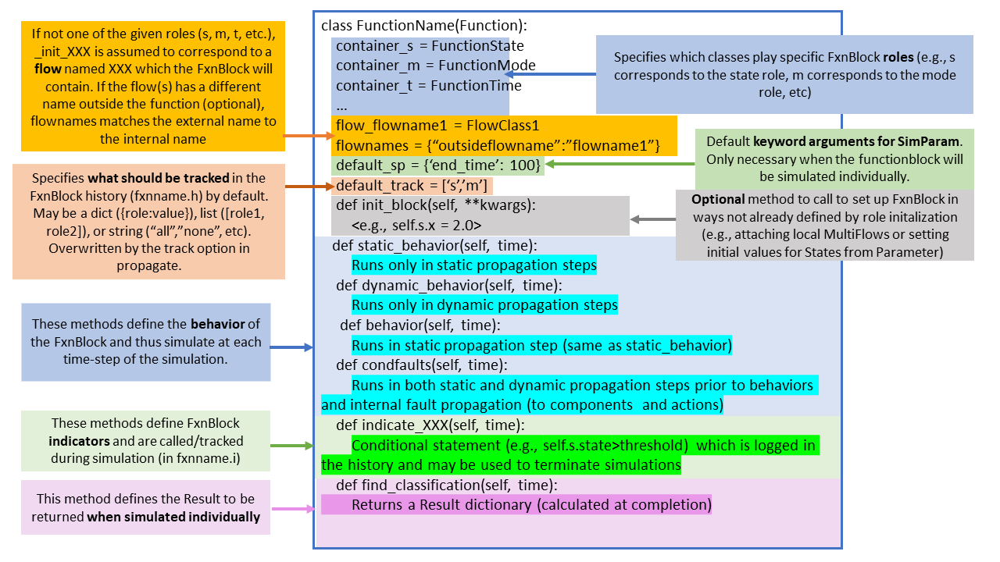

fmdtools.define.block
===========================

The block subpackage provides a representation of blocks, which are simulable models which may contain containers and other properties.

These variants of block are provided in the following modules:

* :mod:`base`: for :class:`Simulable`, which is used for all simulations (including architectures) and :class:`Block`, which is used for blocks.
* :mod:`action`: for :class:`Action`, which is used to represent actions.
* :mod:`component`: for :class:`Component`, which is used to represent components.
* :mod:`function`: for :class:`Function`, which is used to represent functions.

fmdtools.define.block.base
--------------------------------

.. automodule:: fmdtools.define.block.base
   :members:
   :undoc-members:
   :show-inheritance:

fmdtools.define.block.action
--------------------------------

.. automodule:: fmdtools.define.block.action
   :members:
   :undoc-members:
   :show-inheritance:

fmdtools.define.block.component
--------------------------------

.. automodule:: fmdtools.define.block.component
   :members:
   :undoc-members:
   :show-inheritance:

fmdtools.define.block.function
--------------------------------

   
   Code template for :class:`Function` used to define high-level system functions and their behavior.

.. automodule:: fmdtools.define.block.function
   :members:
   :undoc-members:
   :show-inheritance: