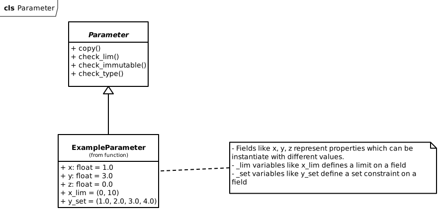

fmdtools.define.container
===========================
.. automodule:: fmdtools.define.container

The containers subpackage provides the elemental building puzzle pieces needed (i.e., containers for holding states, modes, etc.) to develop simulations, shown below.

.. figure:: figures/uml/Containers.svg
   :width: 800
   :alt: fmdtools container classes
   
   Container classes in fmdtools and their inheritance.

These classes are provided in the following modules:

.. autosummary::

	fmdtools.define.container.base
	fmdtools.define.container.mode
	fmdtools.define.container.state
	fmdtools.define.container.parameter
	fmdtools.define.container.rand
	fmdtools.define.container.time

fmdtools.define.container.base
--------------------------------

.. automodule:: fmdtools.define.container.base
   :members:
   :undoc-members:
   :show-inheritance:

fmdtools.define.container.mode
--------------------------------

.. automodule:: fmdtools.define.container.mode
   :members:
   :undoc-members:
   :show-inheritance:

fmdtools.define.container.state
--------------------------------
.. automodule:: fmdtools.define.container.state

State classes are used to represent mutables properties of the system that change over time. State classes are extended and deployed by the user, as shown below: 

.. figure:: figures/uml/State.svg
   :width: 600
   :alt: example state class
   
   Example of extending the :class:`State` class to hold x/y fields.

.. autoclass:: fmdtools.define.container.state.State
   :members: State
   :show-inheritance:

fmdtools.define.container.parameter
--------------------------------

.. automodule:: fmdtools.define.container.parameter

:class:`~fmdtools.define.container.parameter.Parameter` classes are used to represent immutable properties of the system. :class:`~fmdtools.define.container.parameter.Parameter` classes are extended and deployed by the user, as shown below: 

   
   Example of extending the :class:`Parameter` class to hold x/y/z fields.

.. autoclass:: fmdtools.define.container.parameter.Parameter
   :members:
   :show-inheritance:

fmdtools.define.container.rand
--------------------------------

.. automodule:: fmdtools.define.container.rand
   :members:
   :undoc-members:
   :show-inheritance:

fmdtools.define.container.time
--------------------------------

.. automodule:: fmdtools.define.container.time
   :members:
   :undoc-members:
   :show-inheritance:

