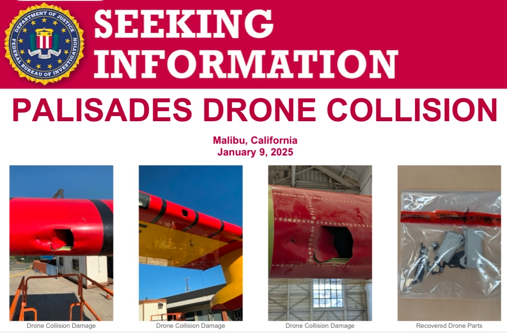
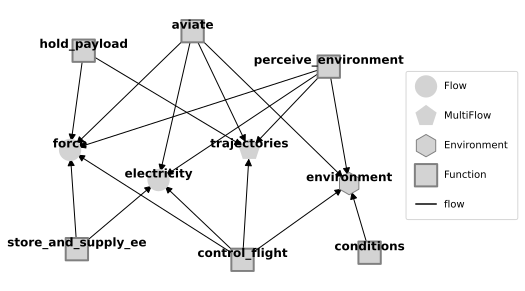
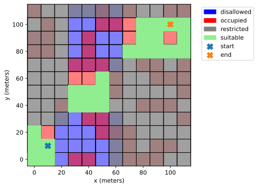

# Drone Contingency Management Model:

## Modelling drone contingency actions in a shared airspace

---
# Why - Understanding drone safety in shared airspace

 - **Consider:**  Why can't drones and piloted aircraft fight fires at the same time?

- **Answer:** We don't yet know how to manage conflicts and drone-related hazards in the shared airspace with access restrictions

 - The goal of this model is to **better understand how to mitigate these hazards**

 
PC: FBI/KTLA, ktla.com/news/california/wildfires/fbi-looking-for-pilot-of-drone-that-grounded-plane-battling-palisades-fire/

---
# What are we trying to do?

Resilience models help us understand how well a system will mitigate hazardous scenarios. In this case, we want to:

1. Evaluate the ability of proximity to threat functionality to enable safe operations in drones

2. Identify backup/redundant battery storage requirements to mitigate battery depletion faults

3. Better understand how a given mission or Concept of Operations can affect resilience(s)

To do this, we adapt the base `dronelib` library build with `fmdtools` to represent drone behavior, and its interactions with its environment in the relevant scenarios.

---
# Setup: Model Structure

- **aviate**: movement of the drone through the air
    - Alters true drone trajectory
- **control_flight**: path planning and control
    - Alters desired drone trajectory
- **store_and_supply_ee**: battery/energy storage
    - Provides electricity to other functions
- **perceive_environment**: Perception of drone location/environment
    - Determines perceived trajectory from true 
- **hold_payload**: Force balance/structure

- **conditions**: External update of environment
    - Determines external drone location(s)

---
# Setup: Environment and Mission

- Drone's mission is to fly from lower-left start point to upper-right end point

- Flies through area not designated "Restricted" (in gray)

- Can land in green "suitable" areas in emergencies

- Cannot land in Occupied (red) and Disallowed (blue) areas

---
# Setup: Path planning and reconfiguration 

- Drone plans path to goal while avoiding restricted airspace and minimizing landing risks

- Drone at a constant height

- Re-planning occurs when hazardous or unexpected conditions are identified: **airspace intrusion** or **low battery**

---
# How resilient is the drone to airspace intrusion?

---
# Would the drone still be resilient to airspace intrusion in a different scenario?

---
# How resilient is the drone to battery depletion?

---
# Would the drone still be resilient to battery faults in a different mission?

---
# Conclusions