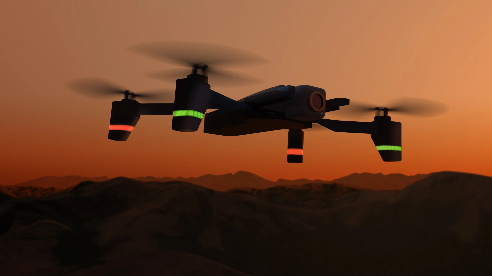
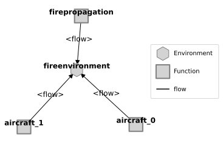
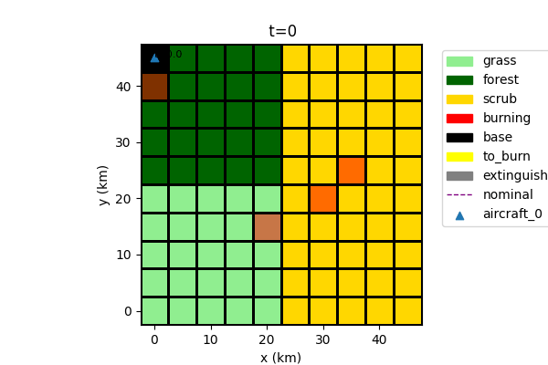
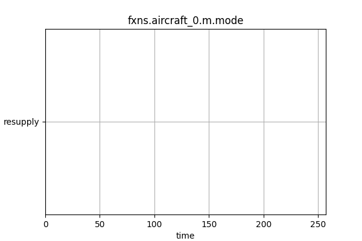

# Wilfire Response Model

## Modelling multi-drone wildfire response

---

# Why - Understanding Effectiveness of Drones in Wildfire response

- Autonomous flight presents some major **long-term** opportunities for Wildfire Response, such as:

    - Flying with reduced risk to pilots
    - Increased aircraft availability for operations 
    - More information to ground operations
    - ...

- In-field evaluation is expensive
    - It's also limited to the types of assets we have now

- Need a testbed for **evaluating radical changes to ConOps** and **Missions enabled by autonomy**

 
PC: NASA/Daniel Rutter, nasa.gov/centers-and-facilities/ames/acero-and-wildland-fires/

---

# What are we trying to do?

- Simulate firefighting response effectiveness of wildfire suppressions in a range of configurations, such as:
    - Types of aircraft
    - Coordination between aircraft
    - Types of bases and their placement

---

# Setup: Model Structure

Major parts:

- FirePropagation: Determines spread of the fire over time based on environmental conditions (e.g., fuels)
- FireEnvironment: Shared grid of fuels, base placements, etc.
- Aircraft(s): Aircraft used for suppression efforts. **The number of aircraft may change depending on configuration**

Other parts could be added as needed e.g., for reconnaissance, lead planes, helicopters, etc.

---

# Setup: Environment and Mission

- Fire propagates depending on environmental conditions 
    - fuels etc.
- Aircraft perform different tasks:
    - Resupply (at base)
    - Flying to base
    - Flying to fire location
    - Fire mitigation (at fire)
- Fire location determined at base and refined in flight

---
# How effective are different numbers of assets?

---
# Can we optimize Air Base Locations?

---
# What about alternative fire scenarios?

---
# Conclusions and Path(s) from here

- [Hulse, D. E., Mbaye, S., & Davies, M. D. (2025). Determining Optimal Asset Location for Rapid and Efficient Wildfire Suppression: A Simulation-Based Approach. In AIAA SCITECH 2025 Forum (p. 0451).](https://ntrs.nasa.gov/api/citations/20240015828/downloads/Wildfire%20Simulation%20Optimization.pdf)

---
# Conclusions for fmdtools

