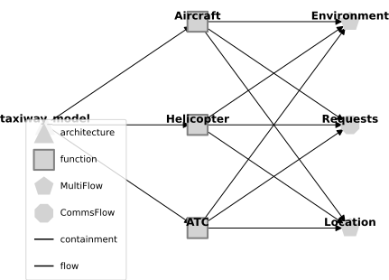
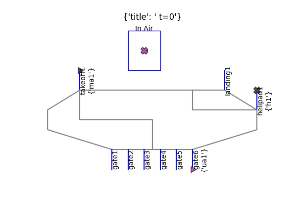
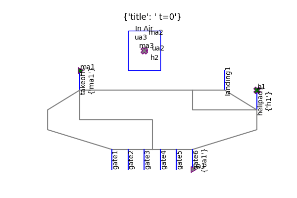
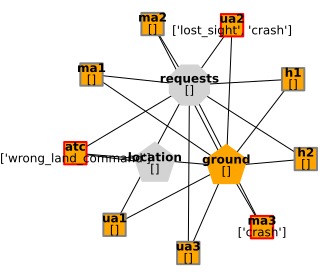
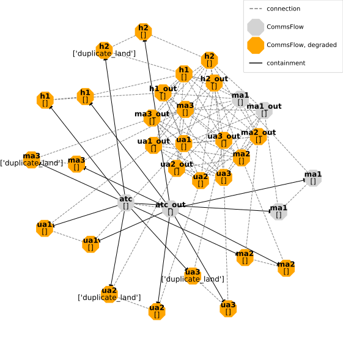

## Motivation

- Safety of systems of systems (such as the airspace) results from the distributed situation awareness of the individual actors (e.g., Pilots, ATC, etc.)

- To best understand this distributed situation awareness of systems of systems, we need ways to represent it in a simulation

- The taxiway model provides a simple systems model of an airport taxiway we can use to understand distributed situation awareness

## Model Structure {.smaller}

:::: {.columns}
::: {.column width="55%"}

The taxiway model has three main agent types:

- `Helicopter`, which lands and takes off from a helipad
- `Aircraft`, which lands at a runway, taxis to a gate, and takes off from a runway
- `ATC`, which coordinates operations

These agents interact via the flows:

- `Ground`, a `MultiFlow` tracking the map as well as agent assignments/allocations
- `Location`, a `MultiFlow` tracking the position/velocity of each route, and
- `Requests`, a `CommsFlow` tracking messages between ATC and assets
:::
::: {.column width="45%"}

:::
::::

## Environment

In this environment, aircraft cycle between `In Air`, `landing`, `gate`, and `takeoff` locations while helicopters cycle between `In Air` and `helipad` locations

## Hazard Simulation - Incorrect Requests {.smaller}

Below, we model the situation of Air Traffic Control issuing an incorrect approval to land that is not caught by `uav2` due to a poor sight (`no_sight` fault).

As shown, in this scenario, the `uav2` lands on an occupied airstrip, causing a crash, and further aircraft are blocked from attempting to land.

Note that while the simulation continues to play out with landings/takeoffs, this would normally cause a shutdown of airport operations.

## Analysis of Distributed Situation Awareness {.smaller}

Distributed Situation awareness in fmdtools can be represented as graphs of information connecting the various agents, as shown below.

:::: {.columns}
::: {.column width="45%"}
{height=250}

At t=20, the map has an overbooked location, while `ua2` and `ma3` have crashed into each other due to the `wrong_land_command` issued by `atc`.
:::
::: {.column width="55%"}
{height=250}

This graph shows the extend of the faults effect on communications at time t=10, where the in-air aircraft now have been given duplicate landing commands
:::
:::: 

## Conclusions

- The taxiway model showcases how fmdtools can be used to model distributed situation awareness in a complex system-of-systems

Further reading:

- Irshad, L., & Hulse, D. (2025). Toward Early Design Modeling and Simulation of Distributed Situation Awareness. Journal of Computing and Information Science in Engineering, 25(6), 061001.

- [paper_jcise_dsa.ipynb](paper_jcise_dsa.ipynb)