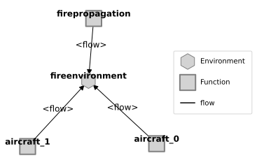
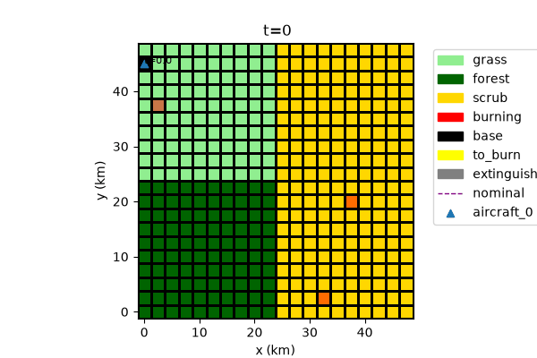
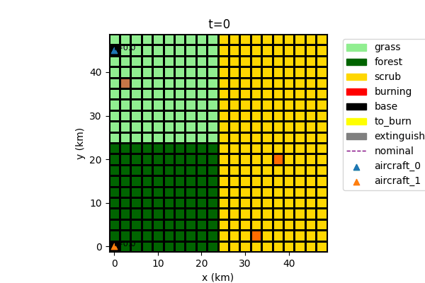
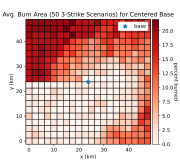
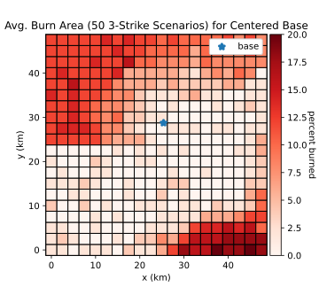
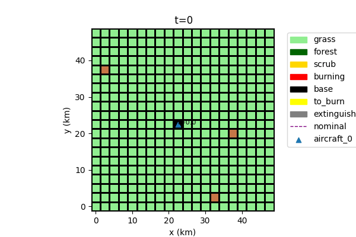
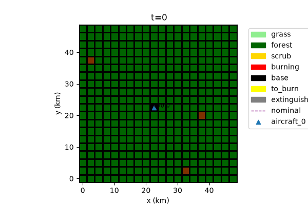

# Wildfire Response Model Overview

Modelling multi-drone wildfire response

---

## Why - Understanding Effectiveness of Drones in Wildfire response

- Autonomous flight presents some major **long-term** opportunities for Wildfire Response, such as:

    - Flying with reduced risk to pilots
    - Increased aircraft availability for operations 
    - More information to ground operations
    - ...

- In-field evaluation is expensive
    - It's also limited to the types of assets we have now

- Need a testbed for **evaluating radical changes to ConOps** and **Missions enabled by autonomy**

 
PC: NASA/Daniel Rutter, nasa.gov/centers-and-facilities/ames/acero-and-wildland-fires/

---

## What are we trying to do?

- Simulate firefighting response effectiveness of wildfire suppressions in a range of configurations, such as:
    - Types of aircraft
    - Coordination between aircraft
    - Types of bases and their placement

---

## Setup: Model Structure

Major parts:

- FirePropagation: Determines spread of the fire over time based on environmental conditions (e.g., fuels)
- FireEnvironment: Shared grid of fuels, base placements, etc.
- Aircraft(s): Aircraft used for suppression efforts. **The number of aircraft may change depending on configuration**

Other parts could be added as needed e.g., for reconnaissance, lead planes, helicopters, etc.

---

## Setup: Environment and Mission

- Fire propagates depending on environmental conditions 
    - fuels etc.
- Aircraft perform different tasks:
    - Resupply (at base)
    - Flying to base
    - Flying to fire location
    - Fire mitigation (at fire)
- Fire location determined at base and refined in flight

---
## How effective are different numbers of aircraft?

- More effective (Fire out at t=25 min) due to more rapid response!
    - Fire is out before spreading out of control
- Assumption is one base per asset - can be improved in future work

---
## What if we move the location of the air base?

- Study showed that response performs better when the base is closer to faster-burning fuels
- Down to 5% average area burned from 8% (see figures at right) over a range of 50 3-strike fire scenarios.
- This optimization approach can be re-used to tailor the response to different maps 

See: [Hulse, D. E., Mbaye, S., & Davies, M. D. (2025). Determining Optimal Asset Location for Rapid and Efficient Wildfire Suppression: A Simulation-Based Approach. In AIAA SCITECH 2025 Forum (p. 0451).](https://ntrs.nasa.gov/api/citations/20240015828/downloads/Wildfire%20Simulation%20Optimization.pdf)

---
## What about alternative fire scenarios?

- Grass -> Fire more likely to spread uncontrollably
- Forest -> Fire mitigated quickly without spreading

These assumptions are simplistic!
- Real fires are much less predictable and firefighting is much less effective

---
## Conclusions and Path(s) from here

What we have:
- A pretty basic multi-aircraft aerial firefighting model
- Can answer some questions about base allocation

Potential extensions:
- Add aircraft interactions in shared airspace
- Aerial reconnaissance and situation awareness effects (studied previously in smart-stereo model*)
- Helicopters and ground-based fire mitigation
- Add in broad range of fire behaviors--wind, heat, etc.--to improve realism
- Ability to tailor to real historic fires
- Add in and study fault/failure scenarios

 
* Andrade, S. R., & Hulse, D. E. (2022). Evaluation and improvement of system-of-systems resilience in a simulation of wildfire emergency response. IEEE Systems Journal, 17(2), 1877-1888. ntrs.nasa.gov/api/citations/20210021739/downloads/ISJ-RE-21-13446-finalpdf-combined.pdf 

---
## Conclusions for fmdtools

- Showcases ability of fmdtools to model Systems of Systems where:
    - Multiple assets interacting with a shared environment
    - Many scenarios (strike locations, maps) for environment are possible
    - Environment also changes dynamically over time
- Showcases parameterization--number of assets as well as properties of the environment can be changed
- Shoowcases ability to efficiently optimize complex SoS models over a range of scenarios (in this case strike locations)